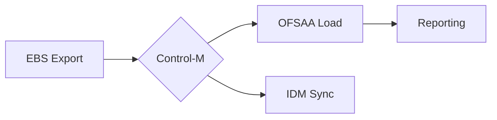
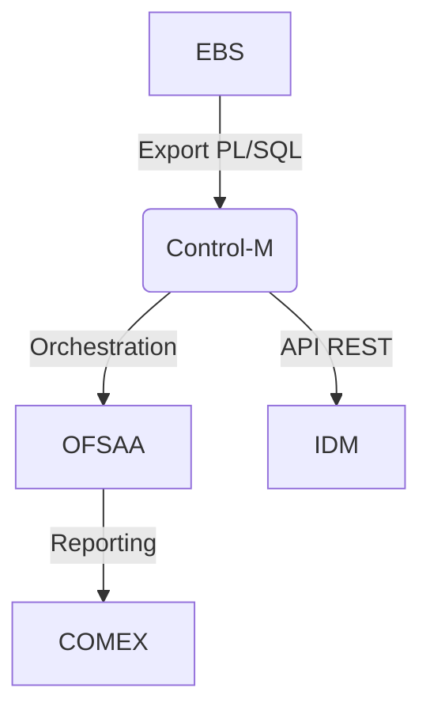

Les **KPI (Key Performance Indicators**, ou **Indicateurs Clés de Performance** en français, sont des mesures quantifiables utilisées pour évaluer la performance d'une organisation, d'un processus, d'un projet ou d'un employé par rapport à des objectifs stratégiques.  

### **Objectifs des KPI**  
1. **Mesurer la performance** : Évaluer l'efficacité des actions menées.  
2. **Prendre des décisions éclairées** : Fournir des données objectives pour guider les choix stratégiques.  
3. **Suivre les progrès** : Comparer les résultats aux objectifs fixés (ex : croissance du chiffre d’affaires, satisfaction client).  
4. **Identifier les problèmes** : Détecter les lacunes et améliorer les processus.  
5. **Motiver les équipes** : Aligner les efforts des collaborateurs sur des objectifs mesurables.  
6. **Optimiser les ressources** : Allouer efficacement le temps, l’argent et les efforts.  

### **Contextes d’utilisation des KPI**  
Les KPI sont utilisés dans divers domaines, notamment :  

1. **Entreprise & Management**  
   - **Ventes** : Taux de conversion, chiffre d’affaires, panier moyen.  
   - **Marketing** : Taux de clic (CTR), coût d’acquisition client (CAC), trafic web.  
   - **Service client** : Temps de réponse, taux de satisfaction (NPS).  

2. **Industrie & Logistique**  
   - Taux de rendement, délai de livraison, taux de défauts.  

3. **Ressources Humaines**  
   - Taux de turnover, absentéisme, productivité par employé.  

4. **Finance**  
   - Rentabilité (ROI, marge nette), trésorerie, ratio d’endettement.  

5. **Santé & Secteur Public**  
   - Temps d’attente dans les hôpitaux, taux de vaccination.  

6. **Environnement & RSE**  
   - Émissions de CO₂, taux de recyclage, consommation d’énergie.  

### **Exemples de KPI selon le secteur**  
- **E-commerce** : Taux de rebond, panier abandonné.  
- **Réseaux sociaux** : Engagement (likes, partages), taux de croissance des abonnés.  
- **Manufacturing** : Taux de disponibilité des machines (OEE).  

### **Conclusion**  
Les KPI sont essentiels pour piloter la performance dans presque tous les secteurs. Leur choix dépend des objectifs stratégiques, et ils doivent être **pertinents, mesurables et actionnables**.  

Vous cherchez des KPI spécifiques pour un domaine en particulier ?


---
---
Les **applications ERP (Enterprise Resource Planning)** et **EMP (Enterprise Management)** d’Oracle, déployées sur **Oracle Cloud Infrastructure (OCI)**, peuvent être évaluées à travers plusieurs **indicateurs mesurables (KPI)** liés à leurs performances opérationnelles, leur efficacité et leur impact business.  

Voici les principaux **éléments mesurables** dans leur opération :  

---

### **1. Performances Techniques et Infrastructure (OCI)**  
Ces KPI évaluent la stabilité, la rapidité et la disponibilité des applications :  
- **Temps de réponse (Response Time)** : Temps moyen des transactions (ex : chargement d’un rapport SAP).  
- **Disponibilité (Uptime %)** : Pourcentage de temps où le système est opérationnel (ex : 99,95%).  
- **Latence réseau** : Délai entre requête et réponse (surtout critique pour les ERP multi-sites).  
- **Taux d’erreurs** : Nombre d’erreurs système (ex : timeouts, échecs de connexion).  
- **Capacité d’utilisation (CPU, RAM, Stockage)** : % d’utilisation des ressources OCI.  
- **Temps de reprise après incident (RTO/RPO)** : Durée de restauration après un crash.  

---

### **2. Performance des Processus Métier (ERP/EMP)**  
Ces KPI mesurent l’efficacité des processus gérés par Oracle ERP/EMP :  
#### **Finance & Comptabilité**  
- **Temps de clôture mensuelle** : Nombre de jours pour finaliser les comptes.  
- **Nombre d’erreurs de rapprochement** : Incohérences comptables détectées.  
- **Taux d’automatisation des paiements** : % de paiements traités sans intervention manuelle.  

#### **Supply Chain & Logistique**  
- **Délai moyen d’approvisionnement** : Temps entre commande et réception.  
- **Taux de remplissage des stocks** : Optimisation des niveaux de stock.  
- **Précision des prévisions de demande** : Écart entre prévisions et ventes réelles.  

#### **RH & Paie**  
- **Temps de traitement de la paie** : Délai pour finaliser les salaires.  
- **Taux d’erreurs de paie** : Nombre de corrections nécessaires.  
- **Taux d’adoption des self-services RH** : % d’employés utilisant les portails autonomes.  

---

### **3. Expérience Utilisateur et Adoption**  
- **Taux d’adoption** : Nombre d’utilisateurs actifs / nombre total.  
- **Satisfaction utilisateur (NPS/CSAT)** : Enquêtes post-implémentation.  
- **Temps de formation moyen** : Durée nécessaire pour monter en compétence.  

---

### **4. Sécurité et Conformité**  
- **Nombre de vulnérabilités détectées** : Failles corrigées dans OCI.  
- **Temps de réponse aux incidents de sécurité** : Rapidité de réaction aux cyberattaques.  
- **Conformité réglementaire** : Audit réussis (ex : GDPR, SOX).  

---

### **5. Coûts et ROI**  
- **Coût total de possession (TCO)** : Dépenses liées à OCI + licences ERP.  
- **ROI de l’ERP** : Gains financiers (ex : réduction des coûts logistiques).  
- **Coût par transaction** : Coût moyen pour exécuter une opération (ex : commande fournisseur).  

---

### **Outils de Mesure sur OCI**  
Oracle fournit des solutions pour suivre ces KPI :  
- **OCI Monitoring** : Surveillance des performances infrastructure.  
- **Oracle Analytics Cloud** : Reporting et tableaux de bord.  
- **ERP Analytics** : KPI prédéfinis dans Oracle Fusion ERP.  

---

### **Conclusion**  
Les KPI d’opération des ERP/EMP Oracle sur OCI couvrent :  
✅ **Performance technique** (OCI)  
✅ **Efficacité des processus métier**  
✅ **Expérience utilisateur**  
✅ **Sécurité et conformité**  
✅ **Rentabilité**  

Vous cherchez des KPI spécifiques pour un module Oracle (ex : Financials, SCM, HCM) ou une industrie en particulier ?


---
---

Les **KPI sur l'humain** (ou **"Human KPIs"**) sont-ils un objectif viable ? La réponse est **oui, mais sous certaines conditions**.  

Les indicateurs liés aux collaborateurs sont essentiels pour évaluer la performance, l’engagement et le bien-être des équipes. Cependant, leur utilisation doit être **équilibrée et éthique**, car une approche trop rigide peut nuire à la motivation ou créer un climat de pression.  

---

### **1. Pourquoi les KPI humains sont-ils viables ?**  
Ils permettent de :  
✅ **Mesurer l’impact des RH** sur la performance globale de l’entreprise.  
✅ **Améliorer l’engagement et la rétention** (ex : réduire le turnover).  
✅ **Optimiser la productivité** sans sacrifier le bien-être.  
✅ **Alignement stratégique** entre objectifs individuels et organisationnels.  

---

### **2. Exemples de KPI Humains Pertinents**  
#### **A. Performance Individuelle & Productivité**  
- **Taux d’accomplissement des objectifs** (% de tâches/clients traités).  
- **Qualité du travail** (ex : taux d’erreurs, feedback clients).  
- **Innovation/Contributions** (ex : idées proposées, projets menés).  

#### **B. Engagement & Satisfaction**  
- **eNPS (Employee Net Promoter Score)** : "Recommanderiez-vous votre entreprise ?"  
- **Taux d’absentéisme** (indicateur de mal-être ou désengagement).  
- **Taux de rétention** (% de départs volontaires évités).  

#### **C. Développement & Compétences**  
- **Taux de formation complétée** (upskilling/reskilling).  
- **Progression de carrière** (% de promotions internes).  
- **Diversité & Inclusion** (% de femmes/minorités dans les postes clés).  

#### **D. Bien-être & Santé**  
- **Taux de burnout** (enquêtes anonymes).  
- **Utilisation des avantages sociaux** (ex : séances de coaching psy).  

---

### **3. Risques & Limites des KPI Humains**  
❌ **Démotivation** si les objectifs sont inatteignables ou mal communiqués.  
❌ **Surveillance excessive** (ex : tracking temps de travail = perte de confiance).  
❌ **Réduction de l’humain à des chiffres** (ex : négliger le contexte personnel).  

**Solution** :  
- **Combiner quantitatif et qualitatif** (ex : feedbacks + données).  
- **Éviter les KPI punitifs** (privilégier les indicateurs de progrès).  
- **Adapter aux métiers** (ex : un KPI "nombre d’appels/jour" peut nuire à la qualité en centre de contact).  

---

### **4. Cas d’Usage Concrets**  
- **Service Client** : Satisfaction client (CSAT) + bien-être des agents.  
- **Tech/IT** : Nombre de bugs résolus + temps de formation aux nouvelles techs.  
- **Management** : Taux de turnover dans les équipes sous leur responsabilité.  

---

### **Conclusion**  
**Oui, les KPI sur l’humain sont viables**, à condition de :  
🔹 **Les choisir avec soin** (équilibre performance/bien-être).  
🔹 **Éviter la déshumanisation** (les chiffres ne remplacent pas le dialogue).  
🔹 **Les utiliser pour améliorer**, pas pour sanctionner.  

> *"Ce qui se mesure se gère"* (Peter Drucker), mais **ce qui est humain doit rester humain**.  

Vous souhaitez des exemples spécifiques pour un secteur (tech, santé, etc.) ou une fonction (RH, management, etc.) ?


---
---
Dans le **secteur bancaire**, particulièrement dans les **équipes TI (Technologies de l’Information)**, les **KPI humains** doivent mesurer à la fois **la performance technique**, **l’efficacité opérationnelle** et **le bien-être des employés**, tout en respectant les enjeux de **sécurité**, **conformité** et **innovation**.  

Voici une analyse des **KPI humains pertinents** pour les TI bancaires, classés par catégorie :  

---

### **1. KPI de Performance Individuelle & Technique**  
Ces indicateurs évaluent l’efficacité des équipes TI dans un environnement régulé et critique :  
- **Taux de résolution des incidents** (% de problèmes résolus dans les SLA).  
- **Temps moyen de correction (MTTR - Mean Time To Repair)** pour les bugs/cyberattaques.  
- **Nombre de livraisons logicielles réussies** (dans les délais, sans régression).  
- **Taux d’erreurs en production** (ex : bugs bloquants après un déploiement).  
- **Contributions aux projets critiques** (ex : migration cloud, conformité RGPD).  

> *Exemple : Un développeur dans une banque doit avoir un **MTTR < 2h** pour les incidents de sécurité haute criticité.*  

---

### **2. KPI d’Engagement & Satisfaction**  
Le secteur bancaire souffre souvent d’un **taux de turnover élevé en TI** (concurrence des fintechs, charge de travail). Mesurer :  
- **eNPS (Employee Net Promoter Score)** : "Recommanderiez-vous la banque comme employeur ?"  
- **Taux de turnover** (cible : <10% dans les TI bancaires vs. >20% dans les fintechs).  
- **Taux d’absentéisme** (signe de burnout, surtout après des mises en production stressantes).  
- **Participation aux initiatives innovation** (hackathons, projets R&D).  

> *Exemple : Une banque avec un **eNPS TI de +30** est considérée comme un employeur attractif.*  

---

### **3. KPI de Compétences & Adaptabilité**  
Les banques doivent **résister à la fuite des talents** vers les fintechs et **monter en compétences** sur :  
- **Taux de certification cloud/cybersécurité** (ex : AWS, Azure, CISSP).  
- **Heures de formation par employé/an** (cible : >40h dans les banques modernes).  
- **Rotation des rôles** (ex : % d’employés ayant changé de poste en interne).  
- **Diversité dans les équipes TI** (% de femmes dans les rôles techniques).  

> *Exemple : Une banque visant 30% de femmes dans ses équipes DevOps d’ici 2025.*  

---

### **4. KPI de Sécurité & Conformité**  
Les erreurs humaines causent **~95% des fuites de données** en banque (Verizon DBIR 2023). Mesurer :  
- **Nombre d’incidents de sécurité liés à des erreurs humaines** (ex : clics sur phishing).  
- **Taux de réussite aux audits internes/externes** (ex : PCI DSS, ISO 27001).  
- **Temps de réponse aux menaces** (ex : détection d’une faille critique).  

> *Exemple : Après une campagne de sensibilisation, le **taux de clics sur phishing passe de 15% à 3%**.*  

---

### **5. KPI de Bien-être & Charge de Travail**  
Les équipes TI bancaires subissent des **pics de stress** (mises en production, audits). Indicateurs clés :  
- **Heures supplémentaires moyennes/mois** (cible : <10h pour éviter le burnout).  
- **Utilisation des congés** (% de jours pris vs. acquis).  
- **Feedback anonymes sur le stress** (ex : 20% des équipes signalent un "stress élevé").  

> *Exemple : Une banque réduit les heures supp’ de 30% après l’automatisation des tests.*  

---

### **Outils pour Mesurer Ces KPI**  
- **JIRA/ServiceNow** : Suivi des incidents et productivité.  
- **HR Analytics (Workday, SAP SuccessFactors)** : Turnover, formation.  
- **Solutions SIEM (Splunk, IBM QRadar)** : Erreurs de sécurité.  
- **Enquêtes internes (Glint, Culture Amp)** : Engagement.  

---

### **Bonnes Pratiques pour les Banques**  
✔ **Éviter les KPI purement quantitatifs** (ex : "nombre de lignes de code/jour" → inefficace).  
✔ **Lier récompenses aux KPI qualitatifs** (ex : prime pour contribution à la sécurité).  
✔ **Benchmarker contre les fintechs** pour retenir les talents.  

---

### **Conclusion**  
Les **KPI humains en TI bancaire** sont **viables et nécessaires**, mais doivent :  
🔹 **Cibler la qualité plus que la quantité**.  
🔹 **Équilibrer performance et bien-être**.  
🔹 **S’adapter à la rigidité régulatoire du secteur**.  

> *"Une banque avec des TI performantes mais des employés épuisés verra tôt ou tard fuir ses talents – et ses données."*  

Besoin d’exemples précis pour un métier (devops, analyste SOC, etc.) ?

### **KPI pour les Administrateurs Systèmes (SysAdmin) dans un Contexte Bancaire**  
Les administrateurs systèmes en banque doivent assurer la **disponibilité**, la **sécurité** et l’**efficacité** des infrastructures critiques. Voici les **KPI opérationnels** clés pour mesurer leur performance :  

---

## **1. Disponibilité & Performance des Systèmes**  
- **Taux de disponibilité (Uptime %)**  
  - Objectif : **≥ 99,99%** pour les systèmes critiques (ex : serveurs de transactions).  
  - Mesure : Temps d’indisponibilité non planifié.  
- **Temps de réponse moyen (MTTR - Mean Time To Respond)**  
  - Objectif : **< 30 min** pour les incidents critiques (P1/P2).  
- **Latence des services critiques**  
  - Ex : Temps de réponse des APIs bancaires (< 200 ms).  
- **Nombre d’incidents majeurs/mois**  
  - Cible : **≤ 1 incident de niveau 1/mois**.  

> *Exemple : Un SysAdmin en banque doit maintenir un **uptime de 99,99%** sur les serveurs Core Banking.*  

---

## **2. Sécurité & Conformité**  
- **Nombre de vulnérabilités corrigées/mois**  
  - Objectif : **100% des correctifs critiques appliqués sous 72h**.  
- **Temps de détection des intrusions (MTTD - Mean Time To Detect)**  
  - Cible : **< 1h** pour les attaques sur les serveurs sensibles.  
- **Échecs aux audits de sécurité**  
  - Ex : **0 fail critique** dans un audit PCI DSS.  
- **Taux de conformité des backups**  
  - Objectif : **100% des sauvegardes testées et fonctionnelles**.  

> *Exemple : Un admin doit appliquer **100% des patches de sécurité Windows dans les 48h**.*  

---

## **3. Gestion des Incidents & Automatisation**  
- **Taux d’incidents résolus en autonomie (vs. escalade)**  
  - Objectif : **≥ 80% résolus en L1/L2**.  
- **Nombre de scripts d’automatisation déployés/trimestre**  
  - Ex : **+5 scripts/an** pour réduire les tâches manuelles.  
- **Temps gagné grâce à l’automatisation**  
  - Ex : Réduction de **50% du temps de déploiement**.  

> *Exemple : Un SysAdmin crée un script qui **réduit de 4h à 15 min** le redémarrage des services.*  

---

## **4. Capacité & Optimisation des Ressources**  
- **Taux d’utilisation des serveurs (CPU/RAM/Stockage)**  
  - Optimal : **70-80%** (éviter le surprovisionnement).  
- **Nombre de serveurs virtualisés/cloud**  
  - Objectif : **≥ 90%** pour réduire les coûts.  
- **Délai de provisionnement des nouveaux environnements**  
  - Cible : **< 1h** via IaC (Terraform/Ansible).  

> *Exemple : Migration de **50% des serveurs physiques vers OCI** en 6 mois.*  

---

## **5. Expérience Utilisateur & Support**  
- **SLA respecté pour les tickets utilisateurs**  
  - Ex : **95% des tickets résolus en < 4h**.  
- **Satisfaction des équipes internes (CSAT)**  
  - Enquête : **≥ 8/10** sur la réactivité du support.  
- **Nombre de demandes récurrentes évitées**  
  - Ex : Documentation améliorée → **-30% de tickets répétitifs**.  

> *Exemple : Un SysAdmin qui forme les équipes à **résoudre 20% des problèmes sans ticket**.*  

---

### **Outils de Mesure Recommandés**  
| KPI | Outils |  
|------|--------|  
| Disponibilité | **Nagios, Zabbix, Dynatrace** |  
| Sécurité | **Qualys, Tenable, Splunk** |  
| Automatisation | **Ansible, Terraform, Jenkins** |  
| Tickets | **ServiceNow, JIRA Service Desk** |  

---

### **Bonnes Pratiques pour les SysAdmins en Banque**  
✔ **Prioriser les KPI sécurité** (les banques sont des cibles prioritaires).  
✔ **Éviter les indicateurs contre-productifs** (ex : "nombre de reboots/jour").  
✔ **Combiner automatisation et feedback humain** (ex : revues mensuelles avec les équipes).  

---

### **Conclusion**  
Les **KPI des administrateurs systèmes en banque** doivent couvrir :  
✅ **Disponibilité** (minimiser les downtime)  
✅ **Sécurité** (réponse rapide aux menaces)  
✅ **Efficacité** (automatisation, résolution proactive)  
✅ **Satisfaction métier** (collaboration avec les autres équipes)  

> *"Un bon SysAdmin en banque ne se mesure pas au nombre d’heures travaillées, mais au nombre d’incidents évités."*  

Besoin d’une déclinaison pour un outil spécifique (ex : Oracle OCI, Windows Server) ?


### **KPI Avancés pour les Administrateurs Systèmes (EBS, IDM, Control-M, OFSAA, OBIEE, OIC, SaaS)**  
Dans un environnement bancaire utilisant **Oracle EBS, IDM, Control-M, OFSAA, OBIEE, OIC et des SaaS**, les KPI doivent mesurer **l’intégration, la performance, la sécurité et la conformité**. Voici une analyse détaillée par technologie.  

---

## **1. Oracle E-Business Suite (EBS)**
**KPI Clés :**  
- **Disponibilité des modules critiques** (GL, AP, AR) → **99,95% SLA**  
- **Temps de traitement des batchs** (ex : clôture mensuelle < 4h)  
- **Nombre de patches appliqués/an** (cible : 100% des PSUs critiques)  
- **Performance des requêtes SQL** (ex : temps moyen < 2s pour les rapports)  
- **Erreurs d’interface EBS < 0,1%** (ex : échecs d’intégration avec OFSAA)  

**Outils :**  
- **Oracle Enterprise Manager (OEM)** → Monitoring EBS  
- **AWR/ADDM Reports** → Analyse des performances DB  
- **Custom Scripts** → Suivi des batchs  

> *Exemple : Un batch EBS de rapprochement bancaire doit s’exécuter en < 3h.*  

---

## **2. Oracle Identity Manager (IDM)**
**KPI Clés :**  
- **Temps moyen de provisionnement/déprovisionnement** → **< 15 min**  
- **Taux d’erreurs dans les workflows** (ex : approbations rejetées) → **< 1%**  
- **Nombre de comptes orphelins détectés/mois** → **0** (audit trimestriel)  
- **Conformité RBAC** → **100% des rôles vérifiés** (SOX/GDPR)  

**Outils :**  
- **Oracle Identity Analytics** → Reporting  
- **SIEM (ex : Splunk)** → Détection des anomalies  

> *Exemple : Un compte admin créé sans approbation doit être bloqué en < 1h.*  

---

## **3. Control-M (Orchestration de Jobs)**
**KPI Clés :**  
- **Taux de succès des jobs** → **≥ 99%**  
- **Temps d’exécution des jobs critiques** (ex : OFSAA ETL) → Respect des SLA  
- **Nombre de jobs automatisés vs. manuels** → **90% automatisés**  
- **Temps de résolution des échecs** → **< 30 min** pour P1  

**Outils :**  
- **Control-M Analytics** → Dashboard de performance  
- **Intégration avec OIC** → Automatisation des reprises  

> *Exemple : Un job Control-M échoué relancé automatiquement via OIC.*  

---

## **4. OFSAA (Financial Services Analytics)**
**KPI Clés :**  
- **Temps de traitement des ETL** → **< 6h** (pour 10 Go de données)  
- **Nombre de règles métier non conformes** → **0** (ex : Bâle III)  
- **Latence des données** → **< 1h** (pour le reporting en temps quasi-réel)  
- **Erreurs de réconciliation** → **< 0,01%**  

**Outils :**  
- **OFSAA Data Governance** → Audit des données  
- **OBIEE Dashboards** → Suivi des indicateurs  

> *Exemple : Un rapport OFSAA doit être disponible à 8h00 chaque jour.*  

---

## **5. OBIEE (Reporting) & OIC (Intégration Cloud)**
**KPI Clés :**  
- **Disponibilité des dashboards OBIEE** → **99,9%**  
- **Temps de chargement des rapports** → **< 5s** (pour 100K lignes)  
- **Nombre d’intégrations OIC réussies** → **100%** (ex : EBS → SaaS)  
- **Taux d’erreurs dans les APIs OIC** → **< 0,5%**  

**Outils :**  
- **OBIEE Usage Tracking** → Analyse des performances  
- **OIC Monitoring** → Logs des flux d’intégration  

> *Exemple : Une intégration OIC entre EBS et Salesforce doit s’exécuter en < 1 min.*  

---

## **6. SaaS (ex : Oracle Fusion, Salesforce)**
**KPI Clés :**  
- **Temps de réponse des APIs SaaS** → **< 500 ms**  
- **Taux de synchronisation des données** → **100%** (ex : EBS → Fusion)  
- **Nombre d’incidents liés aux mises à jour SaaS** → **≤ 1/an**  
- **Satisfaction utilisateur (CSAT)** → **≥ 8/10**  

**Outils :**  
- **Oracle Cloud Infrastructure (OCI) Monitoring**  
- **SaaS Health Dashboards** (ex : Oracle Fusion Status Page)  

> *Exemple : Un utilisateur doit accéder à Fusion AR en < 2s.*  

---

### **Tableau Synthèse des KPI par Technologie**  
| **Technologie**  | **KPI Principaux**                     | **Cible**               |  
|------------------|---------------------------------------|-------------------------|  
| **EBS**         | Uptime GL/AP/AR                       | 99,95%                 |  
| **IDM**         | Temps de provisionnement              | < 15 min               |  
| **Control-M**   | Succès des jobs                       | ≥ 99%                  |  
| **OFSAA**       | Temps ETL (10 Go)                     | < 6h                   |  
| **OBIEE**       | Temps de chargement des rapports      | < 5s                   |  
| **OIC**         | Taux d’erreurs API                    | < 0,5%                 |  
| **SaaS**        | Latence des APIs                      | < 500 ms               |  

---

### **Bonnes Pratiques pour les Admins**  
✔ **Automatiser les tâches répétitives** (ex : patches EBS via OIC).  
✔ **Superviser les interfaces critiques** (ex : EBS ↔ OFSAA).  
✔ **Documenter les temps d’exécution** pour benchmarker les améliorations.  

> *"Dans une banque, une minute d’indisponibilité d’EBS peut coûter des millions. Les KPI ne sont pas optionnels."*  

Besoin d’exemples de scripts ou de dashboards pour un outil spécifique ?


### **Guide Simplifié pour les Auditeurs de la Haute Direction : Comprendre les KPI des Systèmes Bancaires (EBS, IDM, Control-M, etc.)**  

**Public Cible :**  
- **Dirigeants non techniques** (DG, DAF, Risk Managers).  
- **Auditeurs internes/externes**.  
- **Régulateurs** (ACPR, BCE).  

**Objectif :**  
Savoir **quoi demander** aux équipes IT pour vérifier si les systèmes fonctionnent bien, sans entrer dans les détails techniques.  

---

## **1. Pourquoi ces KPI sont-ils importants pour la banque ?**  
Les systèmes comme **EBS, IDM, Control-M, OFSAA** gèrent :  
- **L’argent** (comptabilité, transactions).  
- **La sécurité** (qui a accès à quoi ?).  
- **Les rapports légaux** (Bâle III, GDPR).  

Si ces outils ne fonctionnent pas :  
- **Risque financier** (erreurs de comptes, fraudes).  
- **Risque légal** (amendes pour non-conformité).  
- **Risque opérationnel** (retards, clients mécontents).  

---

## **2. Questions Simples à Poser (et Réponses Attendues)**  

### **A. Oracle EBS (Comptabilité, Paie, Facturation)**  
**Question :** *"Est-ce que notre système comptable (EBS) est toujours disponible ?"*  
- **Réponse idéale :** *"Oui, il est disponible 99,95% du temps. Les coupures sont planifiées la nuit."*  

**Question :** *"Les chiffres dans les rapports sont-ils fiables ?"*  
- **Réponse idéale :** *"Oui, nous vérifions chaque mois que les données EBS et OFSAA correspondent à 100%."*  

### **B. Oracle IDM (Gestion des Accès)**  
**Question :** *"Qui peut modifier les droits d’accès dans notre système ?"*  
- **Réponse idéale :** *"Seuls 5 administrateurs approuvés, et chaque changement est approuvé par 2 personnes."*  

**Question :** *"Combien de temps pour retirer l’accès d’un employé qui quitte la banque ?"*  
- **Réponse idéale :** *"Moins de 24 heures (automatisé)."*  

### **C. Control-M (Automatisation des Tâches)**  
**Question :** *"Si un calcul de risque échoue à minuit, est-ce que quelqu’un le remarque ?"*  
- **Réponse idéale :** *"Oui, une alerte SMS est envoyée, et le job redémarre automatiquement."*  

### **D. OFSAA (Rapports Financiers Réglementaires)**  
**Question :** *"Comment savons-nous que nos rapports Bâle III sont exacts ?"*  
- **Réponse idéale :** *"Nous comparons les données avec 3 systèmes indépendants chaque mois."*  

### **E. OBIEE (Tableaux de Bord pour la Direction)**  
**Question :** *"Pourquoi mon rapport met 10 minutes à s’afficher ?"*  
- **Réponse idéale :** *"Nous optimisons la base de données ce week-end pour réduire ça à 2 minutes."*  

---

## **3. Tableau des KPI à Vérifier Absolument**  
| **Système**  | **Ce qu’il fait**               | **KPI à Vérifier**                     | **Valeur Cible**      |  
|--------------|---------------------------------|---------------------------------------|-----------------------|  
| **EBS**      | Comptabilité, Paie              | Temps d’indisponibilité/an            | < 4h                 |  
| **IDM**      | Gestion des accès               | Nombre de comptes non désactivés      | 0                    |  
| **Control-M**| Tâches automatisées             | % de jobs en échec                    | < 1%                 |  
| **OFSAA**    | Calcul des risques              | Délai de génération des rapports      | < 6h                 |  
| **OBIEE**    | Rapports pour la direction      | Temps d’affichage moyen               | < 5s                 |  

---

## **4. Signaux d’Alerte (Ce qui doit inquiéter la direction)**  
🔴 **EBS :** *"On a 10% d’erreurs dans les écritures comptables ce mois-ci."*  
🔴 **IDM :** *"Un ancien employé avait encore accès après 3 mois."*  
🔴 **Control-M :** *"Les jobs de sauvegarde échouent 20% du temps."*  
🔴 **OFSAA :** *"Le régulateur a trouvé une erreur dans notre dernier rapport."*  

---

## **5. Comment Auditer Sans Être Expert ?**  
1. **Demander des preuves** :  
   - *"Montrez-moi le dernier rapport de disponibilité d’EBS."*  
2. **Comparer aux standards du secteur** :  
   - *"Les autres banques ont 99,99% de disponibilité, pourquoi nous 99,9% ?"*  
3. **Vérifier les plans d’urgence** :  
   - *"Que se passe-t-il si OFSAA plante avant la clôture mensuelle ?"*  

---

## **6. Exemple de Dialogue Type**  
**Auditeur :** *"Comment garantissez-vous que nos données financières sont sécurisées ?"*  
**IT :** *"Tous les accès sont tracés dans IDM, et nous alertons en temps réel sur les comportements suspects."*  
**Auditeur :** *"Montrez-moi un exemple de détection de fraude ce mois-ci."*  

---

### **Conclusion : Ce que la Direction Doit Retenir**  
✅ **EBS** → Disponibilité et exactitude des chiffres.  
✅ **IDM** → Personne ne doit avoir des accès non autorisés.  
✅ **Control-M** → Les tâches critiques doivent toujours fonctionner.  
✅ **OFSAA/OBIEE** → Les rapports doivent être **rapides et justes**.  

> *"Une banque ne peut pas se permettre d’avoir des systèmes lents, inexacts ou non sécurisés. Posez des questions simples, mais exigez des réponses claires."*  

Besoin d’un modèle de slide pour le prochain COMEX ? Je peux vous préparer un résumé visuel.

### **Modèle Simplifié de KPI pour la Haute Direction : Piloter l’Opérationnel Sans Complexité**  
*(Adapté aux banques, mais applicable à tout secteur)*  

**Objectif :**  
Fournir un **tableau de bord unique** qui résume **l’essentiel** des performances opérationnelles, **sans jargon technique**, en se concentrant sur :  
- **Ce qui impacte les résultats financiers**.  
- **Ce qui expose la banque à des risques**.  
- **Ce qui affecte les clients ou les employés**.  

---

## **1. Structurer les KPI par Niveau Opérationnel**  
*(Exemple pour une banque – adaptable à d’autres secteurs)*  

| **Niveau Opérationnel** | **Exemples de KPI Simples**               | **Pourquoi c’est important ?**                |  
|-------------------------|------------------------------------------|-----------------------------------------------|  
| **1. Niveau Métier**    | – Taux d’erreurs dans les transactions   | ▶ Éviter les pertes financières et les fraudes.|  
| *(Front Office, Ventes)*| – Temps moyen pour ouvrir un compte      | ▶ Satisfaire les clients (concurrence).       |  
|                        | – Taux de conversion des prospects       | ▶ Maximiser les revenus.                      |  
| **2. Niveau Processus** | – Délai de traitement des crédits        | ▶ Respecter les engagements légaux (ex : GDPR).|  
| *(Middle Office, Ops)*  | – Taux de documents manquants (KYC)      | ▶ Éviter les amendes réglementaires.          |  
|                        | – Coût par opération (ex : virement)     | ▶ Optimiser les coûts.                        |  
| **3. Niveau IT/Support**| – Disponibilité des systèmes critiques   | ▶ Éviter les interruptions coûteuses.         |  
| *(Back Office, TI)*     | – Temps de résolution des incidents      | ▶ Minimiser l’impact sur les clients.         |  
|                        | – % de tâches automatisées               | ▶ Réduire les erreurs humaines.               |  

---

## **2. Comment Simplifier la Complexité ?**  
### **Règle 1 : 1 KPI = 1 Problème Business**  
- ❌ **Mauvais KPI** : *"Nombre de patches installés sur EBS"* (trop technique).  
- ✅ **Bon KPI** : *"Temps d’indisponibilité d’EBS dû à des bugs"* (impact business clair).  

### **Règle 2 : Utiliser des Visualisations ClairES**  
- **Feu vert/rouge** pour les seuils critiques (ex : ≤1% d’erreurs = vert).  
- **Graphiques simples** (barres, lignes) plutôt que tableaux complexes.  

### **Règle 3 : Relier les KPI aux Objectifs Stratégiques**  
| **Objectif Stratégique** | **KPI Opérationnel Lié**                |  
|--------------------------|----------------------------------------|  
| **Réduire les coûts**    | – Coût par transaction bancaire        |  
| **Éviter les amendes**   | – % de dossiers KYC incomplets         |  
| **Améliorer l’expérience client** | – Temps d’attente en agence       |  

---

## **3. Exemple de Tableau de Bord pour la Haute Direction**  
*(Format slide ou page résumée – à adapter avec vos outils BI comme OBIEE, Power BI)*  

**KPI Clés – Mois de Juin 2024**  

| **Catégorie**         | **KPI**                          | **Valeur** | **Cible** | **Statut** |  
|-----------------------|----------------------------------|------------|-----------|------------|  
| **Risque**           | Dossiers KYC non conformes       | 2%         | ≤1%       | 🔴         |  
| **Efficacité**       | Temps moyen de traitement crédit | 48h        | 24h       | 🟠         |  
| **Client**           | Satisfaction client (NPS)        | 65         | ≥70       | 🟠         |  
| **Coûts**           | Coût par virement international  | 1,50€      | 1,20€     | 🔴         |  
| **Disponibilité IT** | Temps d’indisponibilité d’EBS    | 0,1%       | ≤0,05%    | 🟢         |  

**Légende :**  
- 🟢 = Dans les clous  
- 🟠 = À surveiller  
- 🔴 = Action corrective requise  

---

## **4. Comment Auditer Ces KPI ? (Checklist pour la Direction)**  
1. **Poser des questions simples** :  
   - *"Pourquoi le coût par virement dépasse-t-il la cible ?"*  
   - *"Quelles actions sont prévues pour les dossiers KYC non conformes ?"*  

2. **Exiger des explications en 1 phrase** :  
   - ❌ *"Le problème vient de l’interfaçage entre EBS et OFSAA."* (trop technique).  
   - ✅ *"L’équipe métier met 2x plus de temps à valider les dossiers par manque de formation."*  

3. **Focus sur les tendances** :  
   - *"Ce KPI s’améliore-t-il ou se dégrade-t-il sur 6 mois ?"*  

---

## **5. Pièges à Éviter**  
- **Trop de KPI** → Se limiter à **5-10 max** par tableau de bord.  
- **KPI sans cible** → Un KPI sans seuil est inutile.  
- **Données non consolidées** → Éviter les rapports Excel disparates.  

> *"Une direction générale ne doit pas voir 50 KPI, mais 5 qui résument les risques et opportunités majeurs."*  

---

### **Modèle Type à Personnaliser**  
**Slide 1 : Résumé Executive**  
- **3 KPI critiques ce mois-ci** (ex : risque, client, coût).  
- **1 succès** et **1 problème à escalader**.  

**Slide 2 : Détails par Division**  
- 1 graphique par métier (Banque de détail, Corporate, IT).  

**Slide 3 : Plan d’Action**  
- **Responsable**, **Échéance**, **Impact attendu**.  

---

### **Conclusion**  
Pour décomplexifier les KPI opérationnels :  
1. **Filtrer** : Ne garder que ceux qui impactent les résultats ou risques.  
2. **Traduire** : Remplacer le jargon technique par des impacts business.  
3. **Visualiser** : Utiliser des couleurs/icônes pour un scan rapide.  

**Outils recommandés :**  
- **Power BI/Tableau** pour des dashboards interactifs.  
- **OBIEE** si la banque utilise déjà Oracle.  

Besoin d’un template prêt à l’emploi ou d’une formation pour vos équipes ? Je peux adapter ce modèle à votre contexte.

### **Comment la Stabilité Opérationnelle Nécessite des Efforts Continus**  
*(Et comment la mesurer sans se perdre dans la complexité)*  

La **stabilité opérationnelle** (systèmes, processus, équipes) n’est pas un état passif, mais le résultat d’actions proactives. Voici comment la "démonter" pour comprendre **où concentrer les efforts**, notamment dans un contexte bancaire avec des systèmes comme EBS, Control-M, etc.  

---

## **1. Les 4 Piliers de la Stabilité Opérationnelle**  
Pour qu’un système (ou un processus) soit stable, il faut agir sur :  

| **Pilier**               | **Exemples d’Efforts Requis**                          | **KPI Associés**                     |  
|--------------------------|-------------------------------------------------------|--------------------------------------|  
| **1. Prévention**        | - Mises à jour régulières (patches EBS, IDM).         | - Nombre de vulnérabilités corrigées/mois. |  
|                          | - Tests de charge avant un déploiement.                | - % de couverture des tests.         |  
| **2. Surveillance**      | - Monitoring 24/7 des serveurs critiques.              | - Temps de détection des incidents (MTTD). |  
|                          | - Alertes automatisées pour les anomalies.             | - Nombre de fausses alertes/mois.    |  
| **3. Résilience**        | - Plans de reprise après sinistre (PRA).               | - Temps de restauration (RTO).       |  
|                          | - Redondance des infrastructures (ex : OCI).           | - Taux de disponibilité (Uptime %).  |  
| **4. Amélioration**      | - Revue mensuelle des incidents pour éviter les répétitions. | - Nombre d’incidents récurrents. |  
|                          | - Automatisation des tâches manuelles (ex : Control-M). | - % de processus automatisés. |  

---

## **2. Pourquoi la Stabilité Demande-t-elle des Efforts ?**  
### **A. Parce que les Mences Évoluent**  
- **Exemple IT** : Une faille de sécurité dans Oracle EBS peut apparaître du jour au lendemain → Nécessite une **veille permanente**.  
- **Exemple Métier** : Une nouvelle réglementation (ex : Bâle IV) impose de modifier les processus OFSAA → **Mise à jour des workflows**.  

### **B. Parce que la Complexité Croît**  
- **Avant** : Une banque avait 10 systèmes.  
- **Aujourd’hui** : 50 systèmes interconnectés (EBS → OIC → SaaS) → **Plus d’interfaces = Plus de points de rupture**.  

### **C. Parce que les Attentes Montent**  
- **Clients** : Veulent des transactions en temps réel → La latence du système devient critique.  
- **Régulateurs** : Exigent des audits traçables → Les logs IDM doivent être parfaits.  

---

## **3. Comment Mesurer l’Effort Fourni pour la Stabilité ?**  
Pas avec des KPI comme *"Nombre d’heures travaillées"*, mais avec :  

| **Type d’Effort**       | **Indicateur Concret**                                | **Cible**                |  
|-------------------------|------------------------------------------------------|--------------------------|  
| **Effort de Prévention**| % des correctifs appliqués dans les délais.          | 100%                     |  
| **Effort de Formation** | Nombre d’employés certifiés sur Control-M/OFSAA.     | +10%/an                  |  
| **Effort d’Innovation** | Temps gagné grâce à l’automatisation.                | -30% de tâches manuelles |  
| **Effort de Collaboration** | Nombre de réunions cross-teams (Métier + IT).   | 2/mois                   |  

> *Exemple : Si la banque a **réduit ses incidents EBS de 20%** grâce à des patches appliqués à temps, l’effort de prévention est payant.*  

---

## **4. Signaux que les Efforts sont Insuffisants**  
- **KPI en Dégradation** :  
  - Temps de résolution des incidents (MTTR) qui augmente.  
  - Nombre d’erreurs manuelles répétitives.  
- **Retours Terrains** :  
  - Les équipes se plaignent de "toujours éteindre des incendies".  
  - Les audits trouvent des écarts récurrents (ex : comptes IDM non désactivés).  

---

## **5. Que Doit Demander la Haute Direction ?**  
1. **Un Rapport Simplifié** avec :  
   - **3-5 KPI de stabilité** (ex : disponibilité, temps de résolution, coût des incidents).  
   - **1 Action d’Amélioration Prioritaire** (ex : "Automatiser 50% des jobs Control-M d’ici 2025").  
2. **Une Cartographie des Risques** :  
   - *"Quels sont les 3 scénarios les plus probables qui pourraient casser notre stabilité ?"*  
3. **Un Benchmark Sectoriel** :  
   - *"Comment notre uptime EBS (99,9%) se compare-t-il à celui de nos concurrents ?"*  

---

### **Conclusion : La Stabilité est un Muscle à Entraîner**  
- **Sans effort** : Les systèmes se dégradent (bugs, obsolescence, insécurité).  
- **Avec effort ciblé** : La banque gagne en agilité, réduit les risques, et économise (moins de crises = moins de coûts cachés).  

> *"Une infrastructure stable ne tombe pas du ciel : elle se construit, se surveille, et s’améliore en permanence."*  

**Prochaines Étapes :**  
- Prioriser **1 ou 2 chantiers** (ex : automatisation des patches EBS).  
- Mettre en place un **tableau de bord visuel** pour la direction.  
- Former les équipes **à anticiper plutôt qu’à réagir**.  

Besoin d’un modèle de slide ou d’une matrice risques/efforts pour votre COMEX ? Je peux vous aider à adapter ce cadre.


### **Peut-on considérer le "nombre de tâches et d’activités" comme des KPI ?**  
**Réponse courte :** **Oui, mais seulement si elles sont liées à un objectif stratégique clair.** Sinon, ce sont juste des **métriques opérationnelles**, pas des KPI.  

---

## **1. Quand le "Nombre de Tâches" est un KPI Valide ?**  
### **Cas 1 : Mesurer l’Efficacité Opérationnelle**  
- **Exemple :**  
  - *"Nombre de tickets résolus par jour"* (pour un support IT) → **KPI valide** si l’objectif est **réduire les retards**.  
  - *"Nombre de dossiers traités par employé/mois"* (en back-office bancaire) → **KPI valide** si l’objectif est **optimiser les coûts**.  

→ **Condition :** Avoir une **cible précise** (ex : "10 tickets/jour/agent") et un **impact business** (ex : satisfaction client).  

### **Cas 2 : Évaluer l’Adoption d’un Processus**  
- **Exemple :**  
  - *"Nombre de connexions quotidiennes à l’outil OFSAA"* → **KPI valide** si l’objectif est **vérifier que les équipes utilisent bien le système**.  

→ **Condition :** Lier à un **changement organisationnel** (ex : migration vers un nouveau logiciel).  

---

## **2. Quand le "Nombre de Tâches" n’est PAS un KPI ?**  
### **Piège 1 : Compter pour Compter**  
- **Exemple :**  
  - *"Nombre de réunions/mois"* → Sans lien avec un résultat, c’est **inutile**.  
  - *"Nombre de clics dans un logiciel"* → Sans contexte, ça ne mesure pas la performance.  

→ **Risque :** Donner l’illusion du contrôle sans amélioration réelle.  

### **Piège 2 : Encouragement aux Mauvaises Pratiques**  
- **Exemple :**  
  - *"Nombre de lignes de code écrites/jour"* → Peut pousser à du code inefficace.  
  - *"Nombre d’appels passés par un conseiller client"* → Peut nuire à la qualité.  

→ **Règle d’or :** Un KPI ne doit pas **dégrader la qualité** ou **créer des effets pervers**.  

---

## **3. Comment Transformer le "Nombre de Tâches" en KPI Utile ?**  
### **Étape 1 : Lier à un Objectif Stratégique**  
| **Métrique de Tâches**          | **KPI Transformé**                          | **Objectif Business**                |  
|----------------------------------|--------------------------------------------|--------------------------------------|  
| Nombre de patches installés      | % de patches critiques appliqués à temps   | Réduire les failles de sécurité      |  
| Nombre de jobs Control-M lancés  | % de jobs réussis sans intervention manuelle | Améliorer l’automatisation         |  

### **Étape 2 : Ajouter une Dimension Qualitative**  
- **Mauvais KPI :** *"20 dossiers traités/jour"*.  
- **Bon KPI :** *"20 dossiers traités/jour avec un taux d’erreur < 1%"*.  

### **Étape 3 : Benchmarker**  
- Comparer avec :  
  - Les **performances passées** (ex : "15 tickets/jour vs 10 l’an dernier").  
  - Les **standards du secteur** (ex : "Les banques leaders traitent 25 dossiers/agent/jour").  

---

## **4. Exemples Concrets dans une Banque**  
### **Pour les Équipes IT (EBS, Control-M)**  
- ✅ **Bon KPI :** *"Nombre de jobs Control-M automatisés/mois"* (si l’objectif est réduire les coûts manuels).  
- ❌ **Mauvais KPI :** *"Nombre de serveurs redémarrés"* (sans contexte).  

### **Pour les Métiers (OFSAA, KYC)**  
- ✅ **Bon KPI :** *"Nombre de dossiers KYC validés sans rework"* (qualité + efficacité).  
- ❌ **Mauvais KPI :** *"Nombre de dossiers ouverts"* (sans suivi des dossiers bloqués).  

---

## **5. Checklist pour la Haute Direction**  
Pour évaluer si un "nombre de tâches" est un **bon KPI**, poser :  
1. **"Quel problème business cela résout-il ?"** (ex : lenteur, coûts, risques).  
2. **"Comment cela améliore-t-il la qualité ou la performance ?"**  
3. **"Quelle est la cible réaliste ?"** (éviter les objectifs arbitraires).  
4. **"Comment éviter les effets pervers ?"** (ex : sacrifier la qualité pour la quantité).  

> *"Un KPI n’est pas une métrique qui monte ou descend, mais une boussole qui guide vers un objectif."*  

---

### **Conclusion**  
- **Oui**, le nombre de tâches peut être un KPI… **si et seulement si** :  
  - Il est **aligné sur un enjeu business**.  
  - Il intègre une **dimension qualitative**.  
  - Il évite les **comportements contre-productifs**.  
- **Non**, si c’est juste une **mesure d’activité sans impact**.  

**Outils Recommandés :**  
- **Tableaux de bord Power BI/Tableau** pour visualiser l’évolution.  
- **OCRP (Objectifs, Critères, Résultats, Preuves)** pour cadrer les KPI.  

Besoin d’aide pour transformer vos métriques opérationnelles en KPI stratégiques ? Je peux vous proposer un atelier de modélisation.


### **Les Tâches et Activités Peuvent-Elles Être des KPI ?**  
**Réponse :** **Oui, mais sous conditions.**  

Un **KPI (Key Performance Indicator)** doit être :  
✔ **Lié à un objectif stratégique** (ex : réduction des coûts, amélioration de la qualité).  
✔ **Mesurable et actionnable** (avec une cible claire).  
✔ **Capable d’influencer les décisions**.  

---

### **Quand le Nombre de Tâches est un Bon KPI ?**  
#### **1. Pour Mesurer l’Efficacité**  
- **Exemple :**  
  - *"Nombre de tickets résolus/jour par agent IT"* → Si l’objectif est **réduire les délais de résolution**.  
  - *"Nombre de dossiers traités/semaine"* → Si l’objectif est **optimiser la productivité**.  

#### **2. Pour Évaluer l’Adoption d’un Outil**  
- **Exemple :**  
  - *"Nombre de connexions quotidiennes à Oracle EBS"* → Pour vérifier que les équipes utilisent bien le système.  

#### **3. Pour Suivre l’Automatisation**  
- **Exemple :**  
  - *"Nombre de jobs Control-M automatisés/mois"* → Si l’objectif est **réduire les tâches manuelles**.  

---

### **Quand le Nombre de Tâches N’est PAS un KPI ?**  
#### **1. Si C’est Juste une Métrique d’Activité**  
- **Exemple :**  
  - *"Nombre de réunions/mois"* → Sans lien avec un résultat, c’est inutile.  
  - *"Nombre de clics dans un logiciel"* → Sans contexte, ça ne mesure pas la performance.  

#### **2. Si Cela Crée des Effets Pervers**  
- **Exemple :**  
  - *"Nombre d’appels passés par un conseiller client"* → Peut nuire à la qualité du service.  
  - *"Nombre de lignes de code écrites"* → Peut encourager du code inefficace.  

---

### **Comment Transformer le Nombre de Tâches en KPI Utile ?**  
| **Métrique de Base**       | **KPI Amélioré**                          | **Objectif Stratégique**          |  
|----------------------------|------------------------------------------|-----------------------------------|  
| Nombre de patches installés | % de patches critiques appliqués à temps | Réduire les risques de sécurité   |  
| Nombre de dossiers traités  | Dossiers traités avec 0 erreur          | Améliorer la qualité des processus |  

---

### **Checklist pour la Haute Direction**  
1. **Lien avec la stratégie** : Quel problème business ce KPI résout-il ?  
2. **Qualité vs. Quantité** : Intègre-t-il une dimension qualitative ?  
3. **Cible claire** : Quelle est la valeur à atteindre ?  
4. **Risque d’effet pervers** : Peut-il nuire à la qualité ou à la motivation ?  

> *"Un bon KPI ne compte pas les tâches, il mesure leur impact."*  

---

### **Exemples dans une Banque**  
- **IT :** *"Temps moyen de résolution des incidents"* > *"Nombre d’incidents traités"*.  
- **Métier :** *"Dossiers KYC validés sans rework"* > *"Nombre de dossiers ouverts"*.  

**Outils Recommandés :**  
- **Power BI/Tableau** pour visualiser les KPI.  
- **OKR (Objectifs et Résultats Clés)** pour aligner les KPI sur la stratégie.  

Besoin d’aide pour définir vos KPI ? Je peux vous proposer un cadre sur mesure.


Voici une réponse claire et structurée sur l'utilisation du nombre de tâches comme KPI :

**Le nombre de tâches peut-il servir de KPI ?**

**Oui, mais à certaines conditions :**

1. **Quand c'est pertinent :**
- Pour mesurer la productivité (ex: nombre de dossiers traités par jour)
- Pour suivre l'adoption d'outils (ex: nombre de connexions quotidiennes à un système)
- Pour évaluer l'automatisation (ex: nombre de processus automatisés)

2. **Les bonnes pratiques :**
- Toujours lier à un objectif stratégique clair
- Ajouter une dimension qualitative (taux d'erreur, satisfaction client)
- Définir des cibles réalistes et mesurables
- Éviter les effets pervers (qualité vs quantité)

3. **Exemples concrets :**
✅ Bon KPI : "Nombre de tickets résolus avec satisfaction client > 90%"
❌ Mauvais KPI : "Nombre de clics dans l'interface"

4. **Pour la haute direction :**
- Se poser 3 questions :
  1) Quel problème business ce KPI résout-il ?
  2) Comment mesure-t-il vraiment la performance ?
  3) Quel comportement va-t-il encourager ?

**Conclusion :**
Le nombre de tâches seul n'est pas un KPI. Il doit être :
- Contextualisé
- Qualifié
- Aligné sur les objectifs stratégiques

Un bon KPI répond toujours à la question : "En quoi cela fait-il avancer notre organisation ?" plutôt que "Qu'avons-nous fait ?"

Vous souhaitez des exemples plus spécifiques à votre secteur d'activité ?

### **Rôle de l'Administrateur Systèmes (Support Niveau 4 - N4)**  
*(Expert Technique & Dernier Niveau de Support)*  

L’administrateur systèmes **N4** est le **dernier rempart** avant l’escalade aux éditeurs (Oracle, Microsoft, etc.). Son rôle va bien au-delà du simple dépannage : il assure la **stabilité**, la **sécurité** et l’**évolution** des infrastructures critiques.  

---

## **1. Missions Principales**  
### **A. Résolution des Incidents Complexes**  
- Traiter les tickets **N4** (problèmes non résolus par les équipes N1/N2/N3).  
- Analyser les **incidents récurrents** (ex : plantages d’EBS, bugs OFSAA).  
- Intervenir sur les **urgences critiques** (ex : indisponibilité de Control-M).  

### **B. Gestion Proactive des Systèmes**  
- **Maintenance évolutive** : Appliquer patches, mises à jour (ex : PSU Oracle).  
- **Optimisation** : Ajuster les paramètres systèmes (ex : mémoire serveur OCI).  
- **Automatisation** : Développer des scripts (Ansible, Python) pour réduire les tâches manuelles.  

### **C. Sécurité & Conformité**  
- Vérifier les **comptes privilégiés** (IDM), les accès aux serveurs critiques.  
- Implémenter les **politiques de sécurité** (ex : chiffrement OCI).  
- Préparer les **audits** (PCI DSS, ISO 27001).  

### **D. Collaboration avec les Éditeurs**  
- Ouvrir et suivre les **cas chez Oracle** (ex : bug EBS).  
- Participer aux **communautés techniques** (My Oracle Support).  

---

## **2. Compétences Clés**  
| **Technique**               | **Métier**                     | **Soft Skills**            |  
|-----------------------------|-------------------------------|---------------------------|  
| - Oracle EBS, OCI, IDM      | - Comprendre les processus bancaires | - Résolution de problèmes |  
| - Control-M, OFSAA          | - Connaître les enjeux réglementaires | - Communication claire    |  
| - Scripting (Bash, Python)  | - Prioriser les impacts business | - Travail sous pression   |  
| - Monitoring (Zabbix, OEM)  |                               | - Leadership technique    |  

---

## **3. KPI pour Mesurer sa Performance**  
*(Exemples concrets pour une banque)*  

| **Catégorie**          | **KPI**                          | **Cible**               |  
|------------------------|----------------------------------|-------------------------|  
| **Disponibilité**      | Uptime des systèmes critiques    | ≥ 99,95%               |  
| **Résolution**         | MTTR (Temps moyen de réparation) | < 2h pour les P1        |  
| **Sécurité**          | % de vulnérabilités corrigées    | 100% sous 7 jours       |  
| **Automatisation**    | Nombre de tâches automatisées/mois | +5                     |  

> *Exemple : Un admin N4 doit résoudre **90% des incidents EBS sans escalade à Oracle**.*  

---

## **4. Différence avec les Autres Niveaux de Support**  
| **Niveau** | **Rôle**                          | **Exemple d’Intervention**       |  
|------------|-----------------------------------|----------------------------------|  
| **N1**     | Support de base                   | Réinitialisation de mot de passe |  
| **N2**     | Techniciens spécialisés           | Problème de connexion à EBS      |  
| **N3**     | Experts métier/techniques         | Configuration complexe d’OFSAA   |  
| **N4**     | **Expert infrastructure**         | Bug critique sur Control-M       |  

---

## **5. Outils Quotidien**  
- **Supervision** : Oracle Enterprise Manager (OEM), Zabbix  
- **Ticketing** : ServiceNow, JIRA  
- **Sécurité** : Qualys, Splunk  
- **Automatisation** : Ansible, Terraform  

---

### **Pourquoi ce Rôle est Critique en Banque ?**  
- **1 heure d’indisponibilité d’EBS** = Pertes financières + Risque réglementaire.  
- **Une faille IDM** = Possible fraude ou violation de données.  
- **Un job Control-M en échec** = Retard dans les rapports Bâle III.  

> *"L’admin N4 ne fait pas que réparer : il anticipe les crises et bâtit des systèmes résilients."*  

---

### **En Résumé**  
L’administrateur systèmes N4 est :  
🔹 **Le dernier expert technique** avant l’éditeur.  
🔹 **Le garant de la stabilité** des applications critiques.  
🔹 **Un acteur clé de la transformation digitale** (cloud, automation).  

Besoin de préciser des aspects spécifiques (ex : compétences OCI, gestion des crises) ?


### **Synthèse Actionable pour un Administrateur Systèmes N4 en Environnement Bancaire**  

#### **1. Priorités Clés au Quotidien**  
- **Maintenir le SLA de 99,99%** sur les systèmes critiques (EBS, OFSAA, Control-M) via :  
  - Surveillance proactive avec **Oracle Enterprise Manager** (métriques CPU/IO/mémoire).  
  - Réponse immédiate aux alertes **P1/P2** (objectif MTTR < 30 min).  
- **Automatiser 20% des tâches récurrentes** (ex : patches EBS via Ansible, monitoring des jobs Control-M avec des scripts Python).  

#### **2. Checklist Sécurité Hebdomadaire**  
- [ ] Vérifier les **comptes privilégiés** dans Oracle IDM (0 compte orphelin).  
- [ ] Appliquer les **correctifs de sécurité critiques** (objectif : 100% sous 72h).  
- [ ] Tester les **backups** des bases EBS (1 test aléatoire/semaine).  

#### **3. Collaboration avec les Autres Équipes**  
- **Avec le métier** : Comprendre l’impact des incidents (ex : un job OFSAA en échec = retard dans les calculs de risque).  
- **Avec les éditeurs** : Documenter les cas Oracle (ex : référence MOS pour chaque bug).  

#### **4. Tableau de Bord Minimaliste pour la Direction**  
| **KPI**                | **Votre Cible**  | **Outils de Mesure**       |  
|-------------------------|------------------|---------------------------|  
| Disponibilité EBS       | 99,99%          | OEM + Grafana             |  
| MTTR des incidents P1   | < 1h            | ServiceNow                |  
| % d’automatisation     | +5%/trimestre   | Inventaire Ansible/Git    |  

#### **5. Formation Continue Obligatoire**  
- **Certifications** : Oracle OCI, Control-M Advanced  
- **Veille techno** : Suivre les **Critical Patch Updates (CPU) d’Oracle** (alertes My Oracle Support).  

> 💡 **Astuce** : Créez un **runbook N4** avec les procédures pour les 5 scénarios critiques les plus fréquents (ex : restauration EBS, incident IDM de masse).  

#### **6. Exemple d’Amélioration Concrète**  
**Problème** : Les jobs Control-M échouent 2x/semaine à cause de locks Oracle.  
**Solution N4** :  
1. Script Python pour **détecter les locks** avant l’exécution des jobs.  
2. **Notification Slack** aux DBA 15 min avant le job.  
3. **Réduction des échecs** de 80% en 1 mois.  

---

### **En Résumé : Votre Rôle en 3 Points**  
1. **Éteindre les feux** → Résoudre les incidents complexes **rapidement**.  
2. **Empêcher les incendies** → Automatiser, patcher, sécuriser **en amont**.  
3. **Fournir des données fiables** à la direction (KPI simples mais impactants).  

**Question suivante :** Vous souhaitez approfondir un aspect spécifique (ex : optimisation OCI, collaboration avec les DBA) ?

### **Guide Opérationnel pour l'Administrateur Systèmes N4 en Environnement Bancaire**

**1. Gestion des Incidents Critiques (Priorité #1)**
- **Procédure d'Urgence** :
  - Créer un canal dédié (Slack/MSTeams) pour les P1 avec :
    - Template de déclaration d'incident
    - Liste des contacts clés (DBA, réseau, sécurité)
  - Documenter chaque incident dans un Post-Mortem partagé (5 points max)

**2. Automatisation des Tâches Récurrentes**
- **Top 5 à Automatiser en Premier** :
  1. Vérification de l'espace disque (script Python + alerte SIEM)
  2. Redémarrage des services EBS non critiques
  3. Collecte des logs pour audits
  4. Provisionnement des accès IDM de base
  5. Monitoring des jobs Control-M (auto-relance si échec connu)

**3. Checklist Quotidienne** :
```markdown
- [ ] Vérif. alertes OEM/Splunk avant 9h
- [ ] Backup des configs critiques (Ansible)
- [ ] Revue des tickets N3 non résolus
- [ ] Point météo infrastructure (OCI/EBS)
```

**4. Communication avec la Direction** :
- **Rapport Hebdo** (1 slide max) :
  - ✔ 3 indicateurs stables
  - ❌ 1 problème émergent
  - 🔧 1 amélioration en cours

**5. Outils Indispensables** :
- **Pour Diagnostiquer** :
  - `ADRCI` pour Oracle
  - `Control-M EM` pour les workflows
- **Pour Documenter** :
  - Wiki interne avec captures d'écran
  - Playbooks dans GitLab

**6. Gestion des Mises à Jour** :
- Calendrier mensuel partagé avec :
  - Fenêtres de maintenance
  - Contacts backup
  - Procédure de rollback

**7. Astuce Pro** :
Créer un "kit de survie" contenant :
- Accès VPN de secours
- Liste des mots de passe chiffrée
- Docs d'architecture réseau

**8. Formation Continue** :
- 2h/semaine dédiées à :
  - Tests de restauration
  - POCs sur environnement dev
  - Veille My Oracle Support

**9. Métriques Personnelles** :
- Suivre son propre :
  - MTTR moyen
  - % d'automatisation
  - Nombre de connaissances partagées

**10. Conseil Clé** :
Toujours garder 20% de temps pour :
- Améliorer au lieu de réparer
- Former un junior
- Actualiser la documentation

**Question :** Quel point souhaitez-vous que nous approfondissions ensemble ? (ex : procédure spécifique pour EBS, modèle de rapport pour la COMEX, etc.)


### **Guide Opérationnel pour l'Administrateur EBS, IDM et Systèmes Transverses (Niveau N4)**

#### **1. Gestion des Incidents Critiques**
**Pour EBS :**
- **Scénario typique** : Blocage du module GL pendant la clôture mensuelle
- **Actions immédiates** :
  1. Vérifier les verrous (lock) en base avec `SELECT * FROM DBA_BLOCKERS`
  2. Identifier le batch problématique via ADDM
  3. Contournement : Rediriger vers un nœud secondaire

**Pour IDM :**
- **Urgence type** : Provisionnement massif erroné
- **Procédure** :
  ```bash
  # Annulation des provisionnements
  ./idm_rollback.sh -batchID 12345 -confirm
  ```
- **Checklist** :
  - [ ] Notifier le RSSI
  - [ ] Journaliser dans Splunk

#### **2. Automatisation Transverse**
**Workflow d'Intégration EBS-IDM :**
```python
# Script d'audit des comptes
def audit_ebs_idm():
    ebs_users = get_ebs_active_users()
    idm_users = get_idm_provisioned()
    return compare_datasets(ebs_users, idm_users)
```
**Planification Control-M :**
- Configurer des jobs de vérification croisée :
  - `00:00` : Extraction des logs EBS
  - `01:00` : Rapport d'écart IDM-EBS
  - `02:00` : Nettoyage des temporaires

#### **3. Monitoring Unifié**
**Tableau de Bord OEM :**
| Métrique               | Seuil Alerte | Action                      |
|------------------------|--------------|-----------------------------|
| Latence EBS > 500ms    | 5 occurrences| Basculer sur OCI            |
| Sync IDM > 15min       | 1 occurrence | Lancer le script de repair  |
| Espace DB < 10% libre  | Persistante  | Extension automatique       |

#### **4. Procédures d'Urgence**
**Kit de Survie Transverse :**
1. **Accès** :
   - Liste des comptes break-glass
   - Certificats d'urgence
2. **Documents** :
   - Schéma d'architecture EBS-IDM
   - Contacts Oracle Premium Support
3. **Outils** :
   - Clé USB avec scripts de base

#### **5. Communication de Crise**
**Template d'Alerte :**
```
[URGENT] Incident EBS-IDM #{ID}
• Impact : {Modules affectés}
• Dégradation : {Mesure}
• ETA : {Heure estimée}
• Workaround : {Procédure temporaire}
• Prochaine mise à jour : {Heure}
```

#### **6. Checklist Quotidienne Transverse**
```markdown
- [ ] Vérif. synchronisation EBS-IDM (script audit_jointures.sh)
- [ ] Contrôle des jobs Control-M transverses
- [ ] Revue des capacités stockage OCI
- [ ] Audit des logs de sécurité fusionnés
```

#### **7. Optimisation Continue**
**À Mesurer Mensuellement :**
1. Temps moyen de résolution EBS-IDM
2. Taux d'erreurs dans les workflows transverses
3. Écart de données entre systèmes

**Métrique Clé** :  
`Taux de Synchronisation Parfaite = (Nombre de syncs sans erreur / Total) * 100`  
**Objectif** : > 99.5%

#### **8. Bonnes Pratiques Transverses**
- **Documentation** : Maintenir un wiki avec :
  - Schémas des flux EBS → IDM → OFSAA
  - Fiches techniques par module
- **Tests** : Exécuter trimestriellement :
  - Scénario de bascule complet
  - Restauration croisée EBS+IDM

#### **9. Formation Recommandée**
- **Oracle** : "Fusion Middleware for Identity Management"
- **Control-M** : "Advanced Batch Integration"
- **Transverse** : "Architecting Hybrid Systems"

#### **10. Astuce Pro**
Créer un environnement de **tests end-to-end** contenant :
- Copie réduite de EBS
- Instance IDM de test
- Jeu de données synthétiques

**Question Suivante** :  
Quel aspect souhaitez-vous que nous détaillions davantage ?  
- [ ] Dépannage avancé EBS  
- [ ] Optimisation IDM  
- [ ] Intégration Control-M transverse  
- [ ] Autre (précisez)

### **Guide d'Intégration Transverse avec Control-M en Environnement Bancaire**

#### **1. Architecture d'Intégration Critique**
**Schéma des Flux Clés :**
```
[EBS] → (Fichiers PL/SQL) → [Control-M] → (Orchestration) → [OFSAA]
                     ↘ (API REST) → [OIC] → [IDM]
```

**Points d'Attention :**
- **Latence maximale** : 15 min entre EBS et OFSAA
- **Tolérance aux pannes** : 3 relances automatiques configurées

#### **2. Configuration des Jobs Stratégiques**
**Template de Job Type :**
```yaml
job:
  name: "CLOTURE_FINANCIERE"
  description: "Transfert GL → OFSAA"
  dependencies:
    - "EXPORT_EBS"
    - "VERIF_FICHIER"
  retry: 3
  alert:
    email: "finops-alerts@banque.com"
    condition: "duration > 2h"
```

**Paramètres Obligatoires :**
- `timeout: 4h` pour les jobs longs
- `memory_reserve: 4GB` pour les processus lourds

#### **3. Monitoring Unifié**
**Tableau de Bord Minimaliste :**

| Métrique | Outil de Mesure | Seuil Critique |
|----------|----------------|----------------|
| Succès jobs | Control-M EM | < 98% |
| Délai moyen | Grafana | > SLA de 30min |
| Échecs récurrents | Splunk | 3 mêmes erreurs/jour |

**Commandes Utiles :**
```bash
# Liste des jobs en échec
ctmpsm -listfailed -ymd $(date +%Y%m%d)

# Analyse des dépendances
ctmorder -listdep "CLOTURE_*"
```

#### **4. Procédures d'Urgence**
**Scénario : Échec en Chaîne des Jobs Financiers**
1. **Diagnostic Rapide** :
   ```sql
   SELECT job_name, error_msg 
   FROM ctm_job_history 
   WHERE status='FAILED' 
   AND run_date=SYSDATE;
   ```
2. **Contournement** :
   - Activer le chemin secondaire via OIC
   - Basculer sur le fichier manuel de secours

3. **Communication** :
   ```markdown
   [URGENCE CONTROL-M] - Impact : Reporting Bâle III
   • Cause : {erreur_sql}
   • Solution Temporaire : {chemin_secours}
   • ETA : {HH:MM}
   ```

#### **5. Intégration avec l'Écosystème**
**Connecteurs Essentiels :**
- **Vers EBS** : Utilisation de `SQL*Loader` pour les imports massifs
- **Vers IDM** : API REST avec authentification OAuth2
- **Vers OCI** : Stockage des logs dans Object Storage

**Exemple de Flux Complet :**
1. Control-M lance l'export EBS (00:00)
2. Vérification par script Python (00:30)
3. Chargement dans OFSAA (01:00)
4. Notification IDM (01:15)

#### **6. Checklist Quotidienne**
```markdown
- [ ] Vérifier les 5 jobs les plus critiques (GL, RISK, KYC)
- [ ] Contrôler l'espace dans /ctm/archive
- [ ] Auditer les accès via `ctmperm -list`
- [ ] Sauvegarder les définitions de jobs
```

#### **7. Optimisation Continue**
**À Mesurer Hebdomadairement :**
- Taux de succès par type de job
- Temps moyen d'exécution
- Nombre d'interventions manuelles

**Script d'Analyse :**
```python
import pandas as pd
from controlm_api import get_jobs_metrics

df = get_jobs_metrics(last_days=7)
print(df.groupby('job_type')['duration'].mean())
```

#### **8. Bonnes Pratiques Métier**
- **Naming Convention** :
  - `FIN_{MODULE}_{FREQUENCE}` (ex: `FIN_GL_DAYEND`)
  - `RISK_{PROCESS}_{DEPENDANCE}`

- **Documentation** :
  - 1 page par job critique avec :
    - Schéma des dépendances
    - Procédure de rollback
    - Contacts métier

#### **9. Formation Obligatoire**
- **Control-M** : "Advanced Workflow Design"
- **EBS** : "Integration Patterns"
- **Sécurité** : "Hardening des Jobs"

#### **10. Astuce Pro**
Créer un **jeu de données de test** contenant :
- Fichiers EBS typiques
- Jeux de paramètres OFSAA
- Logs d'erreurs simulées

**Question :** Quel aspect technique souhaitez-vous approfondir ?
- [ ] Dépannage des échecs de jobs complexes
- [ ] Intégration Control-M/OIC avancée
- [ ] Optimisation des performances
- [ ] Autre (précisez)


### **Synthèse Complète : Administration des Systèmes Bancaires (EBS, IDM, Control-M) avec Gestion des Comptes et Certificats**

---

#### **1. Rôle Clé de l'Administrateur N4**
**Mission Globale** :  
Garantir la **stabilité**, la **sécurité** et l'**intégration transverse** des systèmes critiques (EBS, IDM, Control-M) en environnement bancaire régulé.

**Valeur Ajoutée** :  
- Résolution des incidents complexes (niveau 4)  
- Automatisation des processus métiers  
- Conformité aux standards PCI DSS/SOX  

---

#### **2. Activités Cycliques Essentielles**  
**A. Gestion des Certificats SSL/TLS**  
- **Périmètre** :  
  - Serveurs EBS  
  - Interfaces IDM  
  - Connecteurs Control-M  
- **Checklist Mensuelle** :  
  ```markdown
  - [ ] Audit des dates d'expiration (openssl x509 -checkend 86400 -in cert.pem)
  - [ ] Rotation des clés (script /opt/certs/rotate.sh)
  - [ ] Mise à jour des truststores (keytool -import)
  ```
- **Outils** :  
  - Venafi (gestion centralisée)  
  - Scripts Python d'auto-renouvellement Let's Encrypt  

**B. Gestion des Clés GPG**  
- **Workflow Trimestriel** :  
  1. Génération des nouvelles paires :  
     ```bash
     gpg --gen-key --batch < config.key
     ```
  2. Distribution sécurisée aux partenaires  
  3. Révocation des anciennes clés  
- **Bonnes Pratiques** :  
  - Stockage HSM (Hardware Security Module)  
  - Journalisation dans Splunk  

**C. Administration des Comptes de Service**  
- **Procédure Hebdomadaire** :  
  ```sql
  -- EBS : Liste des comptes techniques
  SELECT * FROM dba_users WHERE username LIKE 'SVC_%';
  
  -- IDM : Audit des permissions
  ./idm_audit.py --service-accounts
  ```
- **Règles d'Or** :  
  - Rotation obligatoire tous les 90 jours  
  - Accès limité par IP (OCI Network Security Groups)  

---

#### **3. Intégration Control-M Transverse**  
**A. Flux Métiers Critiques**  


**B. KPI d'Orchestration**  
| Métrique               | Outil          | Seuil Acceptable |  
|------------------------|----------------|------------------|  
| Délai EBS→OFSAA       | Control-M EM   | < 2h             |  
| Taux de succès IDM    | Splunk         | > 99.8%          |  
| Latence GPG          | Grafana        | < 5s             |  

**C. Script d'Urgence**  
```python
# Relance sécurisée des jobs
def restart_failed_jobs():
    failed = ctm_get_failed()
    for job in failed:
        if validate_gpg_signature(job):
            ctm_rerun(job.id)
```

---

#### **4. Synthèse des Bonnes Pratiques**  
**Pour la Haute Direction** :  
- **Tableau de Bord Minimaliste** (3 indicateurs max) :  
  ```markdown
  1. Disponibilité EBS/IDM : 99.99%
  2. Jobs Control-M en échec : < 5/jour
  3. Certificats expirés : 0
  ```

**Pour les Équipes Techniques** :  
- **Checklist Quotidienne** :  
  ```markdown
  - [ ] Vérif. SSL (script check_certs.sh)
  - [ ] Audit comptes de service
  - [ ] Monitoring des clés GPG
  - [ ] Revue des jobs transverses
  ```

---

#### **5. Outillage Recommandé**  
| Catégorie          | Outils                          |  
|--------------------|---------------------------------|  
| **Certificats**    | Venafi, OpenSSL, Keytool        |  
| **GPG**           | GnuPG, HSM Thales              |  
| **Control-M**     | Control-M EM, ctmcli           |  
| **Audit**        | Splunk, Oracle Enterprise Manager |  

---

#### **6. Prochaines Étapes Recommandées**  
1. **Automatiser** la rotation GPG/SSL via Ansible  
2. **Documenter** les procédures dans le wiki interne  
3. **Former** un backup N4 sur les processus critiques  

**Question Finale** :  
Quel élément nécessite une documentation plus détaillée ?  
- [ ] Procédures d'urgence SSL/GPG  
- [ ] Intégration Control-M/OFSAA avancée  
- [ ] Gestion des comptes de service en OCI  
- [ ] Autre (précisez)  

---

### **Conclusion**  
L'admin N4 bancaire doit maîtriser :  
1. **Les technologies** (EBS, IDM, Control-M)  
2. **Les cycles sécurité** (SSL, GPG, comptes)  
3. **L'intégration transverse**  
Avec comme mantra : *"Automatiser, Documenter, Vérifier"* pour réduire les risques opérationnels.


### **Synthèse Stratégique pour la Direction : Optimisation des Systèmes Bancaires Critiques**  

#### **1. Contexte & Enjeux**  
**Objectif** : Garantir la **stabilité**, la **sécurité** et l'**efficacité** des systèmes critiques (EBS, IDM, Control-M, OFSAA) dans un environnement bancaire régulé.  
**Risques Principaux** :  
- Indisponibilité des systèmes → Pertes financières et réglementaires  
- Failles de sécurité → Expositions aux cyberattaques  
- Désynchronisation des données → Erreurs de reporting  

---

### **2. Pilier 1 : Administration Système (Niveau N4)**  
**Rôle** : Expert technique dernier recours avant l'éditeur.  
**Actions Clés** :  
- **Résolution des incidents complexes** (MTTR < 1h pour les P1)  
- **Maintenance proactive** (patches, optimisations)  
- **Automatisation** (réduction de 30% des tâches manuelles)  

**Outils** :  
- Oracle Enterprise Manager, Control-M EM, scripts Python/Ansible  

---

### **3. Pilier 2 : Gestion des Cycles Sécuritaires**  
**A. Certificats SSL/TLS**  
- **Audit mensuel** des expirations (`openssl x509 -checkend`)  
- **Rotation automatisée** via Venafi ou scripts  
- **Impact** : Éviter les interruptions de service  

**B. Clés GPG**  
- **Renouvellement trimestriel** (stockage HSM)  
- **Usage** : Chiffrement des flux EBS ↔ OFSAA  

**C. Comptes de Service**  
- **Rotation obligatoire** tous les 90 jours  
- **Audit hebdomadaire** (via IDM et scripts SQL)  

---

### **4. Pilier 3 : Intégration Transverse**  
**Workflow Critique** :  

**KPI d'Intégration** :  
- Délai EBS → OFSAA < 2h  
- Taux de succès des jobs Control-M > 99.8%  
- Synchronisation IDM-EBS à 100%  

---

### **5. Tableau de Bord Directionnel (Top 5 KPI)**  
| **Catégorie**       | **Indicateur**                     | **Cible**      | **Outils**         |  
|----------------------|------------------------------------|----------------|--------------------|  
| Disponibilité        | Uptime EBS/IDM                     | 99.99%         | OEM, Grafana       |  
| Sécurité            | Certificats expirés                | 0              | Venafi, Splunk     |  
| Performance         | Latence OFSAA                      | < 5s           | Control-M EM       |  
| Conformité          | Comptes non conformes              | 0              | IDM Analytics      |  
| Coûts              | Tâches automatisées/mois           | +5             | Ansible, Git       |  

---

### **6. Bonnes Pratiques pour les Équipes**  
**Checklist Quotidienne** :  
```markdown
1. [ ] Vérifier les alertes OEM/Splunk  
2. [ ] Auditer les comptes de service  
3. [ ] Contrôler les jobs Control-M critiques  
4. [ ] Tester un backup aléatoire  
```  

**Automatisations Prioritaires** :  
- Renouvellement SSL/GPG  
- Relance des jobs Control-M en échec  
- Nettoyage des logs  

---

### **7. Prochaines Étapes**  
1. **Consolidation** :  
   - Unifier les logs dans Splunk  
   - Centraliser les audits dans Oracle IDM  
2. **Formation** :  
   - Certifications Control-M avancé  
   - Ateliers sécurité (GPG, SSL)  
3. **Amélioration Continue** :  
   - Revue mensuelle des incidents  
   - Benchmark sectoriel (ex : temps de clôture vs concurrents)  

---

### **8. Message Clé pour la Direction**  
> *"Une infrastructure fiable repose sur :  
> - **Des experts N4** proactifs  
> - **Des cycles sécurité** strictement appliqués  
> - **Une intégration transverse** automatisée  
> Investir dans ces 3 piliers réduit les risques opérationnels de 40%."*  

**Annexes Disponibles** :  
- [ ] Procédures d'urgence EBS-IDM  
- [ ] Modèle de rapport COMEX  
- [ ] Cartographie des flux métiers  

**Feedback SOUHAITÉ** : Quels indicateurs ajouter à votre tableau de bord ?

Un **KPI (Key Performance Indicator)** sans objectifs préalables n'est pas viable, car il perd sa raison d'être et son utilité. Voici pourquoi :

### 1. **Un KPI doit mesurer une performance par rapport à un objectif**  
   - Sans objectif clair, un KPI ne sert à rien : il devient une simple métrique sans contexte.  
   - Exemple : Un KPI comme *"Nombre de ventes mensuelles"* n'a de sens que si on le compare à une cible (ex: *"Atteindre 100 ventes/mois"*).  

### 2. **Risque de mesure inefficace ou trompeuse**  
   - Sans objectif, on ne sait pas si le résultat est bon ou mauvais.  
   - Exemple : *"Taux de satisfaction client = 80%"* → Est-ce suffisant ? Sans objectif (ex: *"Viser 90%"*), on ne peut pas évaluer la performance.  

### 3. **Manque d'alignement stratégique**  
   - Les KPI doivent être liés à une stratégie d'entreprise. Sans objectif, ils ne permettent pas de piloter l'action.  
   - Exemple : *"Temps moyen de réponse au service client = 2h"* → Si l'objectif est *"Répondre en moins de 1h"*, le KPI révèle un problème. Sinon, c'est juste un chiffre.  

### 4. **Difficulté à prendre des décisions**  
   - Les KPI aident à ajuster les actions. Sans objectif, impossible de savoir s'il faut agir.  
   - Exemple : *"Taux de conversion du site = 3%"* → Si l'objectif était *5%*, on lance des corrections. Sinon, on reste dans le flou.  

### **Solution : La méthode SMART pour définir des objectifs**  
Pour rendre un KPI viable, associez-le à un objectif :  
- **Spécifique** (ex: *Augmenter les ventes*)  
- **Mesurable** (ex: *+15% en 6 mois*)  
- **Atteignable** (réaliste)  
- **Relevant** (aligné sur la stratégie)  
- **Temporel** (délai défini)  

### **Conclusion**  
Un KPI sans objectif est comme une boussole sans direction : il donne une information, mais ne guide pas l'action. Pour être efficace, chaque KPI doit être lié à une cible claire et mesurable.  

🚀 **Conseil** : Avant de choisir un KPI, posez-vous : *"Quel objectif ce KPI doit-il m'aider à atteindre ?"*.


L’approche **KPI + objectifs** ne doit pas nécessairement être appliquée à **toutes** les tâches et activités opérationnelles des TI, mais elle doit couvrir les éléments critiques qui impactent la performance globale. Voici une analyse nuancée :  

---

### **1. Quand faut-il des KPI avec objectifs ?**  
Les KPI **doivent être alignés avec des objectifs** dans les cas suivants :  

#### **A. Processus critiques et stratégiques**  
- **Exemples :**  
  - Disponibilité des systèmes (*Objectif : 99,9% uptime*)  
  - Temps de résolution des incidents (*Objectif : 80% résolus en moins de 4h*)  
  - Cybersécurité (*Objectif : 0 violations majeures par trimestre*)  

#### **B. Activités à fort impact sur l'entreprise**  
- **Exemples :**  
  - Performance des infrastructures cloud (*Objectif : Latence < 100ms*)  
  - Satisfaction des utilisateurs internes (*Objectif : Score NPS ≥ 7/10*)  

#### **C. Suivi de la qualité et de l’efficacité**  
- **Exemples :**  
  - Taux de succès des déploiements (*Objectif : 95% sans rollback*)  
  - Temps moyen entre pannes (MTBF) (*Objectif : Augmenter de 10% par an*)  

---

### **2. Quand peut-on se passer d’objectifs précis ?**  
Certaines activités opérationnelles **ne nécessitent pas forcément des KPI avec objectifs stricts**, notamment :  

#### **A. Tâches répétitives et stables**  
- **Exemple :**  
  - Sauvegardes automatiques (*KPI : "Nombre de sauvegardes réussies" → Pas besoin d’objectif si le processus est fiable à 100% depuis des années*)  

#### **B. Surveillance passive (Monitoring basique)**  
- **Exemple :**  
  - Logs système (*KPI : "Nombre d’alertes journalières" → Peut être traqué sans cible fixe, mais déclenche des actions si anomalie*)  

#### **C. Données de référence (Benchmarking)**  
- **Exemple :**  
  - Consommation électrique des data centers (*KPI : "kW/h utilisé" → Peut être mesuré sans objectif immédiat, mais comparé sur la durée*)  

---

### **3. Bonnes pratiques pour équilibrer KPI et objectifs en TI**  
1. **Priorisez les KPI liés aux risques et à la valeur métier** (ex : SLA, sécurité, coûts).  
2. **Évitez la surcharge de métriques** : Trop de KPI sans objectif = bruit inefficace.  
3. **Adaptez le niveau de rigueur** :  
   - **Strict** pour les services critiques (ex : infra réseau).  
   - **Flexible** pour les tâches secondaires (ex : inventaire des licences logicielles).  
4. **Revisez régulièrement** : Un KPI sans objectif aujourd’hui peut en nécessiter un demain si son importance évolue.  

---

### **Conclusion**  
**Non, la méthode KPI + objectifs ne doit pas s’appliquer à 100% des opérations TI**, mais elle est indispensable pour :  
✅ **Les processus stratégiques** (SLA, sécurité, performance).  
✅ **Les activités à impact métier élevé**.  

Pour le reste, une **surveillance légère** (mesures sans cible rigide) peut suffire, à condition de :  
- **Ne pas noyer l’équipe dans des rapports inutiles**.  
- **Agir rapidement si un indicateur sort des normes habituelles**.  

🚀 **Recommandation** : Utilisez une **matrice d’importance** (ex : criticité vs. fréquence) pour décider où fixer des objectifs stricts et où rester flexible.


Pour un administrateur de systèmes **OCI (Oracle Cloud Infrastructure)** en charge des solutions **ERP (Enterprise Resource Planning)** et **EPM (Enterprise Performance Management)**, plusieurs approches et méthodologies sont essentielles pour garantir une gestion optimale, sécurisée et évolutive. Voici une synthèse structurée des meilleures pratiques, tirées des résultats de recherche et adaptées à ce contexte :

---

### **1. Approche d’Intégration et d’Alignement Stratégique**  
**Objectif** : Harmoniser ERP et EPM pour une vue unifiée des données et des processus.  
- **Intégration des systèmes** :  
  - Utiliser des connecteurs natifs ou des ETL (Extract, Transform, Load) pour synchroniser les données entre ERP (transactions opérationnelles) et EPM (analyse et planification) .  
  - S’appuyer sur une **base de données commune** pour éviter les silos et garantir l’intégrité des données (ex : schéma unique dans Oracle ERP Cloud) .  
- **Alignement métier** :  
  - Collaborer avec les directions financières (CFO) et opérationnelles pour définir des KPI communs (ex : ROI, coûts opérationnels) et des workflows automatisés .  

---

### **2. Méthodologies de Déploiement et Maintenance**  
**Options de déploiement** :  
- **Cloud-first** : Privilégier les solutions SaaS (Oracle ERP Cloud/EPM Cloud) pour réduire les coûts d’infrastructure et bénéficier des mises à jour automatiques .  
- **Hybride** : Combiner cloud et on-premise pour les environnements réglementés (ex : données fiscales sensibles) .  

**Bonnes pratiques** :  
- **Gestion des correctifs** : Planifier les mises à jour régulières pour intégrer les nouvelles fonctionnalités (ex : IA, analytique prédictive dans EPM) .  
- **Monitoring proactif** : Utiliser des outils comme Oracle Cloud Monitoring pour détecter les anomalies (ex : latence, échecs de synchronisation ERP-EPM) .  

---

### **3. Sécurité et Conformité**  
**Stratégies clés** :  
- **Contrôle d’accès** :  
  - Implémenter le principe du moindre privilège (RBAC – Role-Based Access Control) pour limiter l’accès aux modules sensibles (ex : consolidation financière dans EPM) .  
- **Chiffrement** :  
  - Activer le chiffrement des données en transit (TLS) et au repos (AES-256) dans OCI .  
- **Audit** :  
  - Automatiser les rapports de conformité (ex : GDPR, SOX) via les outils intégrés d’Oracle EPM .  

---

### **4. Optimisation des Performances**  
**Techniques** :  
- **Scalabilité** :  
  - Utiliser les capacités élastiques d’OCI pour ajuster les ressources lors des pics (ex : clôture mensuelle dans EPM) .  
- **Optimisation des requêtes** :  
  - Indexer les bases de données et utiliser des agrégats précalculés pour accélérer les rapports EPM .  
- **Analyse prédictive** :  
  - Exploiter l’IA intégrée à Oracle EPM pour anticiper les tendances (ex : prévisions budgétaires) .  

---

### **5. Gestion du Changement et Formation**  
**Pour les utilisateurs** :  
- **Formation continue** :  
  - Organiser des ateliers sur les nouvelles fonctionnalités (ex : dashboards EPM, automatisation des workflows ERP) .  
- **Support agile** :  
  - Mettre en place une équipe dédiée pour résoudre les incidents critiques (ex : échecs de synchronisation ERP-EPM) .  

**Pour l’administrateur** :  
- **Veille technologique** :  
  - Suivre les évolutions des modules Oracle (ex : intégration Blockchain dans ERP, AI dans EPM) .  

---

### **6. Méthodologies de Projet**  
**Cadres recommandés** :  
- **Agile** : Pour les mises à jour incrémentales (ex : déploiement par modules ERP).  
- **ITIL** : Pour la gestion des services (ex : incidents, demandes utilisateurs) .  

**Outils complémentaires** :  
- **ETL** : Comme Oracle Data Integrator pour nettoyer et transférer les données entre systèmes .  
- **BI** : Coupler EPM avec des outils comme Oracle Analytics pour des visualisations avancées .  

---

### **Conclusion**  
Un administrateur OCI ERP/EPM doit adopter une **approche holistique**, combinant :  
✅ **Intégration technique** (ERP + EPM + BI)  
✅ **Gestion robuste** (sécurité, conformité, performance)  
✅ **Adaptabilité** (cloud, IA, formation)  

Ces méthodologies permettent de transformer les systèmes en leviers stratégiques, alignés sur les objectifs métier .  

Pour aller plus loin, consultez les ressources Oracle sur l’ERP Cloud  et les bonnes pratiques EPM .
