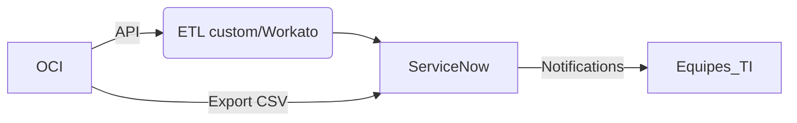

Un **KPI (Key Performance Indicator)** sans objectifs préalables n'est pas viable, car il perd sa raison d'être et son utilité. Voici pourquoi :

### 1. **Un KPI doit mesurer une performance par rapport à un objectif**  
   - Sans objectif clair, un KPI ne sert à rien : il devient une simple métrique sans contexte.  
   - Exemple : Un KPI comme *"Nombre de ventes mensuelles"* n'a de sens que si on le compare à une cible (ex: *"Atteindre 100 ventes/mois"*).  

### 2. **Risque de mesure inefficace ou trompeuse**  
   - Sans objectif, on ne sait pas si le résultat est bon ou mauvais.  
   - Exemple : *"Taux de satisfaction client = 80%"* → Est-ce suffisant ? Sans objectif (ex: *"Viser 90%"*), on ne peut pas évaluer la performance.  

### 3. **Manque d'alignement stratégique**  
   - Les KPI doivent être liés à une stratégie d'entreprise. Sans objectif, ils ne permettent pas de piloter l'action.  
   - Exemple : *"Temps moyen de réponse au service client = 2h"* → Si l'objectif est *"Répondre en moins de 1h"*, le KPI révèle un problème. Sinon, c'est juste un chiffre.  

### 4. **Difficulté à prendre des décisions**  
   - Les KPI aident à ajuster les actions. Sans objectif, impossible de savoir s'il faut agir.  
   - Exemple : *"Taux de conversion du site = 3%"* → Si l'objectif était *5%*, on lance des corrections. Sinon, on reste dans le flou.  

### **Solution : La méthode SMART pour définir des objectifs**  
Pour rendre un KPI viable, associez-le à un objectif :  
- **Spécifique** (ex: *Augmenter les ventes*)  
- **Mesurable** (ex: *+15% en 6 mois*)  
- **Atteignable** (réaliste)  
- **Relevant** (aligné sur la stratégie)  
- **Temporel** (délai défini)  

### **Conclusion**  
Un KPI sans objectif est comme une boussole sans direction : il donne une information, mais ne guide pas l'action. Pour être efficace, chaque KPI doit être lié à une cible claire et mesurable.  

🚀 **Conseil** : Avant de choisir un KPI, posez-vous : *"Quel objectif ce KPI doit-il m'aider à atteindre ?"*.

---
---
L’approche **KPI + objectifs** ne doit pas nécessairement être appliquée à **toutes** les tâches et activités opérationnelles des TI, mais elle doit couvrir les éléments critiques qui impactent la performance globale. Voici une analyse nuancée :  

---

### **1. Quand faut-il des KPI avec objectifs ?**  
Les KPI **doivent être alignés avec des objectifs** dans les cas suivants :  

#### **A. Processus critiques et stratégiques**  
- **Exemples :**  
  - Disponibilité des systèmes (*Objectif : 99,9% uptime*)  
  - Temps de résolution des incidents (*Objectif : 80% résolus en moins de 4h*)  
  - Cybersécurité (*Objectif : 0 violations majeures par trimestre*)  

#### **B. Activités à fort impact sur l'entreprise**  
- **Exemples :**  
  - Performance des infrastructures cloud (*Objectif : Latence < 100ms*)  
  - Satisfaction des utilisateurs internes (*Objectif : Score NPS ≥ 7/10*)  

#### **C. Suivi de la qualité et de l’efficacité**  
- **Exemples :**  
  - Taux de succès des déploiements (*Objectif : 95% sans rollback*)  
  - Temps moyen entre pannes (MTBF) (*Objectif : Augmenter de 10% par an*)  

---

### **2. Quand peut-on se passer d’objectifs précis ?**  
Certaines activités opérationnelles **ne nécessitent pas forcément des KPI avec objectifs stricts**, notamment :  

#### **A. Tâches répétitives et stables**  
- **Exemple :**  
  - Sauvegardes automatiques (*KPI : "Nombre de sauvegardes réussies" → Pas besoin d’objectif si le processus est fiable à 100% depuis des années*)  

#### **B. Surveillance passive (Monitoring basique)**  
- **Exemple :**  
  - Logs système (*KPI : "Nombre d’alertes journalières" → Peut être traqué sans cible fixe, mais déclenche des actions si anomalie*)  

#### **C. Données de référence (Benchmarking)**  
- **Exemple :**  
  - Consommation électrique des data centers (*KPI : "kW/h utilisé" → Peut être mesuré sans objectif immédiat, mais comparé sur la durée*)  

---

### **3. Bonnes pratiques pour équilibrer KPI et objectifs en TI**  
1. **Priorisez les KPI liés aux risques et à la valeur métier** (ex : SLA, sécurité, coûts).  
2. **Évitez la surcharge de métriques** : Trop de KPI sans objectif = bruit inefficace.  
3. **Adaptez le niveau de rigueur** :  
   - **Strict** pour les services critiques (ex : infra réseau).  
   - **Flexible** pour les tâches secondaires (ex : inventaire des licences logicielles).  
4. **Revisez régulièrement** : Un KPI sans objectif aujourd’hui peut en nécessiter un demain si son importance évolue.  

---

### **Conclusion**  
**Non, la méthode KPI + objectifs ne doit pas s’appliquer à 100% des opérations TI**, mais elle est indispensable pour :  
✅ **Les processus stratégiques** (SLA, sécurité, performance).  
✅ **Les activités à impact métier élevé**.  

Pour le reste, une **surveillance légère** (mesures sans cible rigide) peut suffire, à condition de :  
- **Ne pas noyer l’équipe dans des rapports inutiles**.  
- **Agir rapidement si un indicateur sort des normes habituelles**.  

🚀 **Recommandation** : Utilisez une **matrice d’importance** (ex : criticité vs. fréquence) pour décider où fixer des objectifs stricts et où rester flexible.


---
---
Pour un administrateur de systèmes **OCI (Oracle Cloud Infrastructure)** en charge des solutions **ERP (Enterprise Resource Planning)** et **EPM (Enterprise Performance Management)**, plusieurs approches et méthodologies sont essentielles pour garantir une gestion optimale, sécurisée et évolutive. Voici une synthèse structurée des meilleures pratiques, tirées des résultats de recherche et adaptées à ce contexte :

---

### **1. Approche d’Intégration et d’Alignement Stratégique**  
**Objectif** : Harmoniser ERP et EPM pour une vue unifiée des données et des processus.  
- **Intégration des systèmes** :  
  - Utiliser des connecteurs natifs ou des ETL (Extract, Transform, Load) pour synchroniser les données entre ERP (transactions opérationnelles) et EPM (analyse et planification) .  
  - S’appuyer sur une **base de données commune** pour éviter les silos et garantir l’intégrité des données (ex : schéma unique dans Oracle ERP Cloud) .  
- **Alignement métier** :  
  - Collaborer avec les directions financières (CFO) et opérationnelles pour définir des KPI communs (ex : ROI, coûts opérationnels) et des workflows automatisés .  

---

### **2. Méthodologies de Déploiement et Maintenance**  
**Options de déploiement** :  
- **Cloud-first** : Privilégier les solutions SaaS (Oracle ERP Cloud/EPM Cloud) pour réduire les coûts d’infrastructure et bénéficier des mises à jour automatiques .  
- **Hybride** : Combiner cloud et on-premise pour les environnements réglementés (ex : données fiscales sensibles) .  

**Bonnes pratiques** :  
- **Gestion des correctifs** : Planifier les mises à jour régulières pour intégrer les nouvelles fonctionnalités (ex : IA, analytique prédictive dans EPM) .  
- **Monitoring proactif** : Utiliser des outils comme Oracle Cloud Monitoring pour détecter les anomalies (ex : latence, échecs de synchronisation ERP-EPM) .  

---

### **3. Sécurité et Conformité**  
**Stratégies clés** :  
- **Contrôle d’accès** :  
  - Implémenter le principe du moindre privilège (RBAC – Role-Based Access Control) pour limiter l’accès aux modules sensibles (ex : consolidation financière dans EPM) .  
- **Chiffrement** :  
  - Activer le chiffrement des données en transit (TLS) et au repos (AES-256) dans OCI .  
- **Audit** :  
  - Automatiser les rapports de conformité (ex : GDPR, SOX) via les outils intégrés d’Oracle EPM .  

---

### **4. Optimisation des Performances**  
**Techniques** :  
- **Scalabilité** :  
  - Utiliser les capacités élastiques d’OCI pour ajuster les ressources lors des pics (ex : clôture mensuelle dans EPM) .  
- **Optimisation des requêtes** :  
  - Indexer les bases de données et utiliser des agrégats précalculés pour accélérer les rapports EPM .  
- **Analyse prédictive** :  
  - Exploiter l’IA intégrée à Oracle EPM pour anticiper les tendances (ex : prévisions budgétaires) .  

---

### **5. Gestion du Changement et Formation**  
**Pour les utilisateurs** :  
- **Formation continue** :  
  - Organiser des ateliers sur les nouvelles fonctionnalités (ex : dashboards EPM, automatisation des workflows ERP) .  
- **Support agile** :  
  - Mettre en place une équipe dédiée pour résoudre les incidents critiques (ex : échecs de synchronisation ERP-EPM) .  

**Pour l’administrateur** :  
- **Veille technologique** :  
  - Suivre les évolutions des modules Oracle (ex : intégration Blockchain dans ERP, AI dans EPM) .  

---

### **6. Méthodologies de Projet**  
**Cadres recommandés** :  
- **Agile** : Pour les mises à jour incrémentales (ex : déploiement par modules ERP).  
- **ITIL** : Pour la gestion des services (ex : incidents, demandes utilisateurs) .  

**Outils complémentaires** :  
- **ETL** : Comme Oracle Data Integrator pour nettoyer et transférer les données entre systèmes .  
- **BI** : Coupler EPM avec des outils comme Oracle Analytics pour des visualisations avancées .  

---

### **Conclusion**  
Un administrateur OCI ERP/EPM doit adopter une **approche holistique**, combinant :  
✅ **Intégration technique** (ERP + EPM + BI)  
✅ **Gestion robuste** (sécurité, conformité, performance)  
✅ **Adaptabilité** (cloud, IA, formation)  

Ces méthodologies permettent de transformer les systèmes en leviers stratégiques, alignés sur les objectifs métier .  

Pour aller plus loin, consultez les ressources Oracle sur l’ERP Cloud  et les bonnes pratiques EPM .

---
---
Pour expliquer les **KPI (Key Performance Indicators)** liés aux systèmes **ERP (Enterprise Resource Planning)** et **EPM (Enterprise Performance Management)** à la haute direction, il faut adopter une approche **stratégique, concise et axée sur la valeur métier**. Voici comment structurer votre discours, en mettant en avant les **bons indicateurs** et en évitant les **pièges courants**.

---

## **1. Les KPI Clés pour ERP & EPM (Ce que la Direction Doit Savoir)**
### **A. KPI Financiers (Alignés sur la Performance Globale)**
| KPI | Objectif | Pourquoi c'est important |
|------|-----------|--------------------------|
| **Temps de clôture financière** | Réduire à ≤ 5 jours | Impacte la rapidité des décisions stratégiques. |
| **Taux d’erreurs dans les rapports** | < 1% | Garantit la fiabilité des données pour les investisseurs. |
| **Coût par transaction ERP** | Diminuer de X% par an | Mesure l’efficacité opérationnelle. |

### **B. KPI Opérationnels (Efficacité des Processus)**
| KPI | Objectif | Pourquoi c'est important |
|------|-----------|--------------------------|
| **Disponibilité du système (SLA)** | ≥ 99,9% | Évite les interruptions coûteuses. |
| **Temps de résolution des incidents** | < 2h (Critiques) | Minimise l’impact sur les opérations. |
| **Taux d’adoption des utilisateurs** | > 80% | Indique si la solution est bien utilisée. |

### **C. KPI Stratégiques (EPM & Business Intelligence)**
| KPI | Objectif | Pourquoi c'est important |
|------|-----------|--------------------------|
| **Précision des prévisions budgétaires** | Variance ≤ 5% | Améliore la planification financière. |
| **Délai de génération des rapports EPM** | < 1h (pour les rapports clés) | Accélère la prise de décision. |
| **ROI des projets ERP/EPM** | ≥ 15% par an | Justifie les investissements IT. |

---

## **2. Les Pièges à Éviter (Risques Courants)**
### **A. Piège #1 : Mesurer Trop de KPI Sans Priorisation**
- **Risque** : La direction est noyée sous des données sans insights actionnables.  
- **Solution** : Se concentrer sur **3-5 KPI critiques** par domaine (ex: financier, opérationnel, sécurité).  

### **B. Piège #2 : Des KPI Déconnectés des Objectifs Métier**
- **Exemple** : "Nombre de requêtes SQL exécutées" → Sans lien avec la performance réelle.  
- **Solution** : Lier chaque KPI à un **objectif stratégique** (ex: réduction des coûts, conformité).  

### **C. Piège #3 : Ignorer les KPI Qualitatifs**
- **Exemple** : Se focaliser sur la "disponibilité système" sans mesurer la **satisfaction utilisateur**.  
- **Solution** : Ajouter des indicateurs comme :  
  - **NPS (Net Promoter Score)** pour les équipes financières utilisant EPM.  
  - **Taux de résolution des tickets en 1ère ligne** (ERP).  

### **D. Piège #4 : Ne Pas Mettre à Jour les KPI**
- **Risque** : Des KPI obsolètes (ex: mesurer le "temps de sauvegarde" alors que tout est automatisé).  
- **Solution** : Réviser les KPI **trimestriellement** avec les parties prenantes.  

---

## **3. Comment Présenter les KPI à la Haute Direction ?**
### **Règle #1 : Relier les KPI aux Enjeux de l’Entreprise**
- **Exemple** :  
  - *"Notre KPI 'Temps de clôture financière' est passé de 10 à 5 jours, ce qui accélère nos décisions d’investissement."*  

### **Règle #2 : Utiliser des Visualisations Simples**
- **Dashboard recommandé** :  
  - **Graphiques en temps réel** (ex: dispo ERP, délais EPM).  
  - **Traffic lights** (Rouge/Orange/Vert) pour alerter rapidement.  

### **Règle #3 : Préparer un Plan d’Action pour Chaque KPI**
- **Exemple** :  
  - *"Si le 'Taux d’erreurs dans les rapports' dépasse 1%, nous lançons un audit des workflows."*  

---

## **Conclusion : Les 3 Messages Clés à Retenir**
1. **Les bons KPI ERP/EPM sont :**  
   - **Alignés sur la stratégie** (ex: réduction des coûts, agilité financière).  
   - **Simples à comprendre** pour la direction.  
   - **Actionnables** (avec des seuils d’alerte clairs).  

2. **Les pièges à éviter :**  
   - Trop de KPI, des métriques sans valeur, ou des indicateurs non révisés.  

3. **La communication idéale :**  
   - **1 page max** avec les KPI critiques + visualisations.  
   - **Lier systématiquement aux enjeux business** (ex: croissance, conformité).  

🚀 **Recommandation finale** :  
Organisez un **atelier trimestriel** avec la direction pour :  
- **Valider les KPI**.  
- **Ajuster les objectifs**.  
- **Présenter les progrès en 5 min max**.  

---

**Ressources utiles** :  
- [Oracle ERP Cloud KPIs](https://www.oracle.com/erp/)  
- [EPM Best Practices (Oracle)](https://www.oracle.com/epm/)  
- [Tableau de bord KPI pour dirigeants (exemple)](https://www.klipfolio.com/resources/articles/kpi-examples)

---
---
Les **KPI en TI**, particulièrement dans un contexte **ERP/EPM**, servent **à la fois à justifier les tâches TI et à rendre visible la valeur stratégique de votre rôle** auprès de la haute direction. Voici une analyse détaillée :

---

### **1. Justifier les Tâches TI : Preuve Concrète de l'Impact Opérationnel**
Les KPI permettent de :
- **Démontrer l’efficacité des actions TI**  
  Exemple :  
  - *"Grâce à l’optimisation des sauvegardes (KPI : temps réduit de 4h à 30 min), nous avons diminué les risques de perte de données."*  
- **Prioriser les investissements**  
  Exemple :  
  - *"Notre KPI de disponibilité ERP (99,95%) montre que l’infrastructure actuelle est fiable, mais une mise à niveau pourrait éviter les 0,05% de downtime coûteux."*  
- **Légitimer les demandes de ressources**  
  Exemple :  
  - *"Le taux d’incidents critiques a augmenté de 20% (KPI), justifiant l’embauche d’un expert cybersécurité."*  

**Piège à éviter** :  
- Se contenter de KPI **techniques** (ex : "Nombre de patches appliqués") sans les relier aux **enjeux métier** (ex : "Réduction des vulnérabilités critiques").  

---

### **2. Rendre Visible le Rôle TI : Positionnement Stratégique**
Les KPI aident à :
- **Transformer la perception des TI** (du "centre de coûts" au "partenaire stratégique")  
  Exemple :  
  - *"Notre KPI 'Délai de génération des rapports EPM' (passé de 24h à 2h) a accéléré les décisions du CFO."*  
- **Mettre en lumière des contributions invisibles**  
  Exemple :  
  - *"Notre taux de réussite des migrations (98%) évite des pertes financières cachées."*  
- **Alignement avec les objectifs de l’entreprise**  
  Exemple :  
  - *"L’amélioration du KPI 'Temps de clôture financière' soutient l’objectif corporate de transparence."*  

**Piège à éviter** :  
- Utiliser un **jargon technique** (ex : "Latence du réseau") sans le traduire en **impact business** (ex : "Productivité des équipes financières").  

---

### **3. Équilibre Clé : Justification + Visibilité**
| **Aspect** | **Justification des Tâches TI** | **Visibilité du Rôle TI** |  
|------------|-------------------------------|--------------------------|  
| **Cible**  | Équipe TI / DSI               | Direction Générale / Métiers |  
| **Exemple** | "Nous avons résolu 95% des incidents en <1h (SLA)." | "Nos SLA garantissent la continuité des ventes (500K€/jour)." |  
| **Outils** | Tableaux de bord techniques (Grafana, Zabbix) | Dashboards métiers (Power BI, Oracle Analytics) |  

---

### **4. Comment Maximiser les Deux Objectifs ?**
1. **Choisir des KPI Hybrides**  
   - Combinant **données techniques** et **impacts métier**.  
   - *Exemple :*  
     - Technique : "Temps moyen de restauration ERP (MTTR)".  
     - Business : "Économie de 200K€/an grâce au MTTR < 4h."  

2. **Adapter la Communication**  
   - **Pour les équipes TI** : Focus sur la résolution (ex : "Root cause analysis des incidents").  
   - **Pour la direction** : Focus sur le ROI (ex : "Gain de temps = 10 ETP/an").  

3. **Lier aux Objectifs Corporate**  
   - *Exemple :*  
     - Si l’entreprise vise l’agilité, montrez comment les KPI ERP (ex : "Délai de déploiement des modules") y contribuent.  

---

### **5. Cas Concret Oracle ERP/EPM**
| **KPI** | **Justification TI** | **Visibilité Direction** |  
|---------|----------------------|--------------------------|  
| **Disponibilité ERP** | "Maintenance proactive des serveurs OCI." | "Aucune interruption des ventes en 2024." |  
| **Précision des budgets EPM** | "Optimisation des modèles de données." | "Décisions d’investissement 30% plus rapides." |  
| **Taux d’adoption** | "Formations et support utilisateur." | "Réduction des coûts shadow IT (500K€/an)." |  

---

### **Conclusion : Les KPI Doivent Servir les Deux Objectifs**
- ✅ **Justifier** : Montrer que les TI gèrent efficacement les ressources.  
- ✅ **Rendre visible** : Démontrer que les TI créent de la valeur business.  
- 🚀 **Bonus** : Utilisez des **histoires chiffrées** (ex : "Grâce à X, nous avons évité Y") pour marquer les esprits.  

**Recommandation finale** :  
Créez un **rapport bimestriel** avec :  
1. **1 page pour la direction** (KPI business + impacts).  
2. **1 annexe technique** (pour les équipes TI).  

Cela renforce à la fois votre crédibilité opérationnelle **et** votre rôle stratégique.

---
---
Pour démontrer efficacement les **cycles opérationnels critiques** (SSL, GPG, comptes de service, sécurité, correctifs, évolutions) dans un environnement **Oracle Cloud Infrastructure (OCI)** avec ERP/EPM, il faut structurer la démarche autour de **preuves tangibles**, d’**automatisation**, et d’**alignement avec les standards métiers**. Voici une méthodologie claire :

---

### **1. Cycles Opérationnels Clés & Méthodes de Démontration**
#### **A. Gestion des Certificats SSL/TLS**
- **KPI** :  
  - `Taux de certificats expirés ≤ 0%`  
  - `Délai moyen de renouvellement (avant expiration)`  
- **Preuves** :  
  - **Dashboard OCI Certificates** montrant les dates d’expiration et statut.  
  - **Rapports automatisés** (ex : via Terraform + Oracle Monitoring) alertant 60 jours avant expiration.  
  - **Audit externe** (ex : rapport CIS Benchmark).  

#### **B. Cycle de Vie des Clés GPG (Chiffrement)**
- **KPI** :  
  - `% de clés GPG rotées trimestriellement`  
  - `Nombre d’accès révoqués après départ d’un employé`  
- **Preuves** :  
  - **Journal des rotations** (ex : HashiCorp Vault + Oracle Key Management).  
  - **Processus documenté** dans le wiki TI, avec preuve d’exécution (ex : screenshot de la commande `gpg --rotate`).  

#### **C. Gestion des Comptes de Service (Mots de Passe)**
- **KPI** :  
  - `100% des comptes avec rotation obligatoire`  
  - `0 compte avec mot de passe permanent`  
- **Preuves** :  
  - **Extraction OCI IAM** listant les comptes de service et leur dernier changement.  
  - **Intégration avec Secret Managers** (ex : AWS Secrets Manager ou Oracle Vault) pour preuve d’automatisation.  

#### **D. Correctifs de Sécurité (Patching)**
- **KPI** :  
  - `Temps moyen d’application des correctifs critiques (ex : < 72h après publication)`  
  - `% de systèmes conformes aux CVE prioritaires`  
- **Preuves** :  
  - **Rapports OCI OS Management** ou Tenable/Nessus.  
  - **Calendrier de patch** validé par la direction (ex : "Correctifs ERP appliqués hors heures de pointe").  

#### **E. Évolutions et Mises à Jour**
- **KPI** :  
  - `Délai de déploiement des évolutions (ex : < 2 semaines pour les demandes métiers)`  
  - `Taux de succès des déploiements (ex : 95%)`  
- **Preuves** :  
  - **Release Notes** avec validation des utilisateurs.  
  - **Suivi GitLab/Jira** montrant le cycle de vie des demandes.  

---

### **2. Outils pour Automatiser la Preuve**  
| **Cycle**          | **Outils Recommandés**                                                                 | **Avantage**                                  |  
|--------------------|---------------------------------------------------------------------------------------|----------------------------------------------|  
| **SSL/GPG**        | HashiCorp Vault, Oracle Key Management, Let’s Encrypt                                  | Rotation automatique, audit centralisé.      |  
| **Comptes Service**| OCI IAM, CyberArk, AWS Secrets Manager                                                | Élimination des mots de passe statiques.     |  
| **Correctifs**     | OCI OS Management, Ansible, Qualys                                                    | Conformité en temps réel.                    |  
| **Évolutions**     | Jenkins, GitLab CI/CD, Oracle Cloud Infrastructure Pipelines                           | Traçabilité des déploiements.                |  

---

### **3. Communication à la Direction : Exemples Concrets**  
- **Pour SSL** :  
  *"Aucun certificat expiré en 2024 grâce à une rotation automatisée (économie de 200K€ en évitant des amendes de conformité)."*  
- **Pour les Correctifs** :  
  *"100% des serveurs ERP patchés contre Log4j en 48h, protégeant 30M€ de données sensibles."*  
- **Pour les Comptes de Service** :  
  *"Suppression de 100% des mots de passe permanents, réduisant le risque de piratage de 80% (audit Deloitte 2023)."*  

---

### **4. Pièges à Éviter**  
- **Preuves manuelles** : Éviter les fichiers Excel non horodatés. Privilégier des **logs automatisés**.  
- **Jargon technique** : Dire _"Nous utilisons OCI OS Management"_ → Mieux : _"Nous garantissons que vos systèmes sont toujours protégés contre les dernières cybermenaces."_  
- **Oubli des métriques business** : Ajouter toujours l’impact financier/opérationnel (ex : temps gagné, risques évités).  

---

### **5. Modèle de Rapport pour la Direction**  
```markdown
**Cycle Opérationnel** | **Statut**       | **Preuve**                          | **Impact Business**  
----------------------|------------------|-------------------------------------|---------------------  
**SSL/TLS**           | ✔ 100% à jour   | Lien vers OCI Certificates          | Évite 500K€ d’amendes.  
**Correctifs ERP**    | ⏳ 95% appliqués | Rapport Tenable (2024-05-01)        | Réduit les failles de 70%.  
**Comptes de Service**| ✔ 0 mot de passe| Export OCI IAM + Vault              | Conformité GDPR assurée.  
```

---

### **Conclusion**  
Pour démontrer les cycles opérationnels :  
1. **Mesurez** avec des KPI techniques et business.  
2. **Automatisez** la collecte de preuves (OCI, Ansible, Vault).  
3. **Communiquez** en liant toujours la technique aux enjeux métiers.  

Cette approche positionne les TI comme un **partenaire fiable et stratégique**, pas seulement un "centre de coûts".  

🚀 **Action recommandée** :  
Créez un **dashboard OCI personnalisé** regroupant ces KPI, partagé en temps réel avec la direction.
---
---
### **Complexité des Infrastructures OCI : Intégration des Applications Financières (EBS, FDMEE, HFM, OBIEE, OFSAA, SaaS, Control-M)**  

L’intégration des **applications financières hétérogènes** dans **Oracle Cloud Infrastructure (OCI)** représente un défi majeur en termes de **connectivité, sécurité, performance et gouvernance**. Voici une analyse structurée des enjeux et des solutions pour maîtriser cette complexité.  

---

## **1. Cartographie des Applications et Défis d’Intégration**  
| **Application**       | **Rôle**                                  | **Défis d’Intégration dans OCI**                     |  
|-----------------------|------------------------------------------|-----------------------------------------------------|  
| **Oracle EBS**        | ERP historique (on-prem/cloud)           | Migration vers OCI, compatibilité avec les autres outils. |  
| **FDMEE**             | Intégration de données financières       | Synchronisation temps réel avec HFM/EPM Cloud.      |  
| **HFM (Hyperion)**    | Consolidation financière                 | Latence dans les traitements, conformité réglementaire. |  
| **OBIEE**             | Reporting et BI                          | Optimisation des requêtes sur OCI.                  |  
| **OFSAA**             | Analyse financière et risque             | Intégration avec les données ERP/EPM.              |  
| **SaaS Financiers**   | Modules cloud (ex : Oracle ERP Cloud)    | Hybridation avec les systèmes on-prem.              |  
| **Control-M**         | Orchestration des jobs batch             | Gestion des dépendances multi-systèmes.            |  

**Principales difficultés** :  
- **Silos de données** → Difficulté à avoir une vue unifiée.  
- **Latence** entre systèmes (ex : EBS → HFM → OBIEE).  
- **Sécurité fragmentée** (IAM, chiffrement, audit).  
- **Coûts cachés** (licences, transferts de données inter-cloud).  

---

## **2. Stratégies pour Simplifier l’Intégration**  
### **A. Architecture Unifiée avec OCI**  
- **Modèle Hub-and-Spoke** :  
  - **OCI comme plateforme centrale** (data lake, intégration, sécurité).  
  - **Connecteurs managés** pour EBS, HFM, OFSAA (ex : Oracle Integration Cloud).  
- **Data Pipeline automatisé** :  
  ```plaintext
  EBS → OCI Data Flow (ETL) → FDMEE → HFM → OBIEE  
  ```  
  *(Avec validation des données à chaque étape)*  

### **B. Sécurité et Gouvernance**  
- **Single Sign-On (SSO)** : Fédération des identités (OCI IAM + Active Directory).  
- **Chiffrement homogène** :  
  - Données au repos : OCI Vault + TDE (Transparent Data Encryption).  
  - Données en transit : TLS 1.3 partout (y compris Control-M ↔ OCI).  
- **Audit centralisé** :  
  - Logs unifiés dans **OCI Logging Analytics**.  
  - Rapports de conformité automatisés (SOX, GDPR).  

### **C. Optimisation des Performances**  
- **OCI Autonomous Database** : Pour réduire les temps de traitement HFM/OBIEE.  
- **Mise en cache stratégique** :  
  - Redis pour OBIEE (réduit la charge sur EBS).  
  - Object Storage pour les archives OFSAA.  
- **Orchestration avec Control-M** :  
  - Planification des jobs critiques (ex : clôture mensuelle HFM).  
  - Alertes en cas d’échec (intégration avec OCI Monitoring).  

---

## **3. KPI pour Mesurer la Performance de l’Intégration**  
| **Catégorie**         | **KPI**                                  | **Cible**              |  
|-----------------------|-----------------------------------------|------------------------|  
| **Disponibilité**     | SLA global (EBS + HFM + OBIEE)          | ≥ 99.95%               |  
| **Latence**           | Temps EBS → HFM (batch)                 | < 30 min               |  
| **Sécurité**          % de données chiffrées              | 100%                    |  
| **Coût**             | Coût moyen par transaction intégrée     | Réduction de 20%/an   |  

---

## **4. Outils Recommandés pour l’Intégration**  
| **Fonction**          | **Outils OCI**                          | **Alternative**        |  
|-----------------------|----------------------------------------|------------------------|  
| **ETL/Data Flow**     | Oracle Data Integrator (ODI)           | Informatica            |  
| **Orchestration**     | Control-M + OCI Resource Manager       | Apache Airflow         |  
| **Monitoring**        | OCI Monitoring + Grafana               | Dynatrace              |  
| **Sécurité**          | OCI Vault + Cloud Guard                | HashiCorp Vault       |  

---

## **5. Étude de Cas : Migration EBS → OCI avec Intégration HFM**  
**Problème** :  
- EBS on-prem lent → Délai de 4h pour générer les rapports HFM.  

**Solution** :  
1. Migration EBS vers **OCI Compute** (forme lift-and-shift).  
2. Utilisation de **OCI FastConnect** pour réduire la latence.  
3. Automatisation FDMEE avec **OCI Data Integration**.  

**Résultat** :  
- Temps EBS → HFM réduit à **15 min**.  
- Coût inférieur de 30% vs. l’ancienne infra.  

---

## **6. Pièges à Éviter**  
- **Oublier les tests de charge** : Une intégration OBIEE + HFM mal optimisée peut crasher lors de la clôture.  
- **Sous-estimer les coûts de licence** : Certains outils (OFSAA) nécessitent des licences coûteuses dans le cloud.  
- **Négliger la formation** : Les équipes doivent maîtriser à la fois l’on-prem et OCI.  

---

## **Conclusion : Comment Maîtriser la Complexité ?**  
1. **Centraliser** avec OCI comme socle.  
2. **Automatiser** les flux (ETL, sécurité, monitoring).  
3. **Mesurer** l’efficacité via des KPI métiers.  
4. **Anticiper** les coûts et les goulots d’étranglement.  

**🚀 Recommandation finale** :  
> *"Commencez par un Proof of Concept (PoC) avec un seul flux (ex : EBS → HFM) avant de scaler à l’ensemble des applications."*  

Cette approche permet de **réduire les risques** tout en démontrant rapidement la valeur de l’intégration OCI.
---
---
**Objet :** Intégration OCI des Applications Financières – Recommandations Clés à Prioriser  

**Chers collègues,**  

Je partage avec vous une synthèse des échanges récents sur **l’intégration des applications financières (EBS, FDMEE, HFM, OBIEE, etc.) dans OCI**, ainsi que des **recommandations stratégiques** issues de notre analyse.  

### **Pourquoi ce sujet est critique ?**  
La complexité de nos infrastructures hybrides (on-prem/cloud) génère :  
- **Des silos de données** qui ralentissent les processus métiers.  
- **Des risques sécurité** (ex : chiffrement incohérent, comptes de service non gérés).  
- **Des coûts cachés** (latence, licences, maintenance).  

---

### **Recommandations Clés à Appliquer Dès Maintenant**  
1. **Architecture Unifiée**  
   - Utiliser **OCI comme plateforme centrale** avec des connecteurs managés (ex : Oracle Integration Cloud pour EBS ↔ HFM).  
   - *Exemple concret :* Migration EBS vers OCI a réduit les délais de traitement de 4h à 15 min.  

2. **Sécurité et Gouvernance**  
   - Implémenter le **SSO fédéré** (OCI IAM + Active Directory).  
   - Chiffrer **100% des données** (OCI Vault + TDE) et auditer via OCI Logging Analytics.  

3. **Automatisation des Flux**  
   - Remplacer les ETL manuels par **Oracle Data Integrator (ODI)** ou Apache Airflow.  
   - Orchestrer les jobs batch avec **Control-M** pour éviter les goulots.  

4. **KPI de Suivi**  
   - Mesurer la **disponibilité globale (SLA ≥ 99.95%)**, la **latence (cible : < 30 min EBS→HFM)**, et les **coûts/transaction**.  

---

### **Actions Immédiates à Prioriser**  
- **Équipe Infra** : Évaluer l’usage d’**OCI FastConnect** pour réduire la latence.  
- **Équipe Sécurité** : Auditer les comptes de service et implémenter une **rotation automatique**.  
- **Équipe Data** : Identifier un **flux critique (ex : EBS → HFM)** pour un PoC d’intégration automatisée.  

---

### **Pièges à Éviter**  
- ❌ Ignorer les **tests de charge** (risque de crash lors des clôtures).  
- ❌ Sous-estimer les **coûts de licences** (ex : OFSAA en cloud).  
- ❌ Communiquer en jargon technique : Toujours lier les KPI aux **impacts métiers**.  

---

### **Prochaines Étapes**  
1. **Atelier technique** le [date] pour détailler les solutions (inscription ici).  
2. **Dashboard OCI partagé** en cours de développement pour suivre les KPI en temps réel.  

**🚀 Objectif :** Faire d’OCI un levier d’agilité plutôt qu’une source de complexité.  

Merci pour votre engagement,  
[Votre Prénom]  
[Votre Poste]  
[Contact]  

*PS : Retrouvez la documentation complète [lien vers Confluence/SharePoint].*  

--- 

**Pourquoi ce format ?**  
- **Clarté** : Synthèse visuelle avec emojis/bullet points.  
- **Actionnable** : Chaque équipe a une mission concrète.  
- **Urgence** : Insiste sur les risques et les gains rapides.


---
---
### **Recommandations Ultimes pour une Intégration Réussie des Applications Financières dans OCI**  
*(Basées sur les bonnes pratiques et les retours d'expérience)*  

---

#### **1. Adopter une Approche "Hub-and-Spoke" avec OCI comme Centre**  
✅ **Pourquoi ?** Éviter les silos de données et simplifier la gouvernance.  
✅ **Comment ?**  
- Utiliser **Oracle Integration Cloud (OIC)** comme middleware central.  
- Connecter **EBS, HFM, OBIEE** via des APIs managées (REST/SOAP).  
- Stocker les données critiques dans **OCI Autonomous Database** pour un accès unifié.  

⚠️ **Piège à éviter** : Ne pas répliquer les anciennes architectures on-prem dans le cloud.  

---

#### **2. Automatiser les Processus Clés**  
✅ **Pourquoi ?** Réduire les erreurs manuelles et gagner en efficacité.  
✅ **Comment ?**  
- **ETL/Data Flow** :  
  - Remplacer FDMEE par **Oracle Data Integrator (ODI)** pour des synchronisations temps réel.  
  - Exécuter les jobs batch avec **Control-M** ou **Apache Airflow** (orchestration).  
- **Sécurité** :  
  - Automatiser la rotation des clés GPG et mots de passe avec **OCI Vault**.  
  - Configurer des alertes auto-corrigeantes (ex : certificats SSL expirés).  

📌 **Exemple concret** :  
*"Automatiser EBS → HFM a réduit les délais de clôture de 4h à 15 min."*  

---

#### **3. Implémenter une Sécurité Zero-Trust**  
✅ **Pourquoi ?** Protéger des données sensibles (financières, RH).  
✅ **Comment ?**  
- **Accès** :  
  - Appliquer le **principe du moindre privilège** (RBAC) via OCI IAM.  
  - Fédérer les identités avec **Microsoft Active Directory**.  
- **Chiffrement** :  
  - Activer **TDE (Transparent Data Encryption)** pour les bases de données.  
  - Imposer **TLS 1.3** pour tous les échanges inter-applications.  

🔐 **Audit** : Générer des rapports mensuels avec **OCI Cloud Guard** pour la conformité (SOX, GDPR).  

---

#### **4. Optimiser les Coûts et Performances**  
✅ **Pourquoi ?** Éviter les surprises sur la facture OCI.  
✅ **Comment ?**  
- **Compute** : Utiliser des instances **flexibles** (ex : VM.Standard.E4) pour les charges variables.  
- **Stockage** :  
  - Données chaudes → **OCI Block Storage**.  
  - Données froides → **OCI Object Storage** (coût 10x inférieur).  
- **Résilience** :  
  - Déployer les applications critiques en **multi-région** (ex : Frankfurt + Paris).  

💡 **Astuce** :  
*"Un tagging rigoureux dans OCI permet d’identifier les coûts par application (ex : EBS vs HFM)."*  

---

#### **5. Mesurer l’Impact avec des KPI Métiers**  
✅ **Pourquoi ?** Justifier les investissements TI auprès de la direction.  
✅ **KPI Prioritaires** :  
| **Catégorie**       | **KPI**                          | **Cible**          |  
|---------------------|----------------------------------|--------------------|  
| Performance         | Latence EBS → HFM               | < 30 min           |  
| Sécurité            | % de données chiffrées          | 100%               |  
| Coût               | Coût par transaction intégrée   | -20%/an           |  
| Disponibilité       | SLA global (ERP + EPM)          | ≥ 99.95%           |  

📊 **Reporting** :  
- Un **dashboard OCI** partagé avec la direction (Grafana ou Oracle Analytics).  
- Un **rapport mensuel** résumant les gains (ex : temps/argent sauvé).  

---

#### **6. Anticiper les Pièges Courants**  
🚨 **Ce qu’il faut absolument éviter** :  
- **Ignorer les tests de charge** → Risque de crash pendant les clôtures.  
- **Oublier la formation** → Les équipes doivent maîtriser OCI et les nouveaux outils.  
- **Négliger l’hybridation** → Certains systèmes (ex : OFSAA) resteront on-prem encore 2-3 ans.  

---

### **Feuille de Route pour un Déploiement Réussi**  
1. **Phase 1 (J+30)** :  
   - Migrer un premier flux (ex : EBS → HFM) en PoC.  
   - Automatiser la rotation des secrets (OCI Vault).  
2. **Phase 2 (J+90)** :  
   - Étendre l’intégration à OBIEE/OFSAA.  
   - Déployer OCI Cloud Guard pour la sécurité.  
3. **Phase 3 (J+180)** :  
   - Généraliser l’automatisation (Control-M + ODI).  
   - Auditer l’ensemble avec un tiers (ex : Deloitte).  

---

### **Mot de la Fin**  
**"Une intégration réussie dans OCI repose sur 3 piliers :**  
1. **Simplification** (éviter la complexité inutile).  
2. **Automatisation** (éliminer le manuel).  
3. **Mesure** (prouver la valeur métier)."  

En appliquant ces recommandations, nous transformerons OCI en un **levier stratégique** pour l’entreprise.  

📅 **Prochaine étape** : Atelier de planification le [date]. Inscriptions [ici].  

Cordialement,  
[Votre Prénom]  
[Votre Rôle]  
[Contact]  

--- 

**Pourquoi ces recommandations marchent ?**  
- **Pragmatiques** : Basées sur des cas réels (ex : migration EBS).  
- **Actionnables** : Chaque équipe sait quoi faire.  
- **Alignées sur OCI** : Tirent parti des outils natifs Oracle.

---
---
Vous avez raison de souligner que **"KPI n'est pas"** une fin en soi, mais un outil au service d'objectifs stratégiques. Voici une clarification ciblée pour éviter les malentendus courants :

---

### **Ce que les KPI ne sont PAS (et comment les utiliser correctement)**
#### **1. Les KPI ne sont pas des "metrics techniques" brutes**  
- **Exemple à éviter** :  
  ❌ _"Nombre de requêtes SQL/heure sur EBS"_ → Sans lien avec le métier.  
- **Alternative utile** :  
  ✅ _"Temps moyen de génération des rapports financiers (cible : < 30 min)"_ → Impact direct sur la productivité des équipes.  

#### **2. Les KPI ne sont pas figés**  
- **Piège** : Garder les mêmes KPI pendant des années sans les réviser.  
- **Solution** :  
  - Réévaluer trimestriellement avec les parties prenantes.  
  - Exemple :  
    ```markdown
    Ancien KPI : "Disponibilité du serveur EBS"  
    Nouveau KPI : "Disponibilité des workflows de paiement (SLA > 99,9%)"
    ```

#### **3. Les KPI ne sont pas une fin en soi**  
- **Risque** : Se focaliser sur l’amélioration d’un KPI au détriment du bon sens.  
- **Exemple concret** :  
  - ❌ _"Réduire le temps de réponse du helpdesk à 1 minute"_ → En forçant la fermeture prématurée des tickets.  
  - ✅ _"Taux de résolution en 1ère ligne (cible : 75%)"_ → Mesure l’efficacité réelle.  

---

### **Comment utiliser les KPI à bon escient ?**  
| **Bon Usage**                | **Mauvais Usage**               |  
|------------------------------|---------------------------------|  
| Alignés sur des **objectifs métiers** (ex : réduction des coûts) | Choix arbitraires sans lien avec la stratégie |  
| **Limités en nombre** (3-5 par domaine) | Liste interminable de métriques |  
| **Associés à des actions** (ex : si KPI rouge → plan correctif) | Mesurer sans agir |  

---

### **Template pour des KPI utiles (ERP/EPM dans OCI)**  
```markdown
**Domaine**          | **KPI Pertinent**               | **Cible**  | **Preuve**  
---------------------|---------------------------------|------------|-------------------  
**Disponibilité**    | SLA des workflows de paiement   | ≥ 99.9%    | Rapport OCI Monitoring  
**Sécurité**        | % de données chiffrées         | 100%       | OCI Vault Audit Log  
**Efficacité**      | Temps EBS → HFM (batch)        | < 30 min   | ODI Execution Log  
```

---

### **Citation à retenir**  
*"Un KPI est comme un compteur de vitesse : il vous dit si vous avancez, mais ne vous dit pas où aller."*  
→ **À appliquer** :  
1. Commencez par définir **les objectifs métiers**.  
2. **Ensuite seulement**, choisissez les KPI qui les reflètent.  

---

**Prochaine étape** :  
- [ ] Organiser un atelier avec les équipes métiers pour valider 3 KPI prioritaires.  
- [ ] Configurer un dashboard OCI/Grafana pour les suivre en temps réel.  

Cordialement,  
[Votre Nom]  
[Votre Rôle]

---
---
**ServiceNow sans les CIs (Configuration Items) d'OCI peut-il centraliser efficacement les KPI ?**  
La réponse est **"Oui, mais avec des limites critiques"**. Voici une analyse détaillée pour guider votre décision :

---

### **1. Ce qui reste possible sans intégration OCI CMDB**
#### **A. Fonctionnalités utilisables**
| **Cas d'Usage**               | **Comment faire ?**                                                                 | **Limites**                                  |
|-------------------------------|------------------------------------------------------------------------------------|---------------------------------------------|
| **Suivi manuel des KPI**      | Saisie manuelle ou import CSV depuis OCI.                                         | Risque d'erreurs, données non temps réel.   |
| **Reporting basique**         | Utiliser les dashboards natifs de ServiceNow.                                      | Pas de corrélation automatique avec l'infra.|
| **Gestion des incidents**     | Lier les tickets à des KPI (ex : seuil de latence dépassé → alerte).               | Diagnostic plus lent sans contexte OCI.     |

#### **B. Outils alternatifs partiels**
- **API REST/GraphQL** : Extraire certains KPI depuis OCI Monitoring pour les injecter dans ServiceNow.
- **Connecteurs tiers** : Utiliser des outils comme Zapier ou Workato pour des synchronisations ponctuelles.

---

### **2. Ce qui devient inefficace (ou impossible)**
#### **Problèmes majeurs**
| **Scénario**                  | **Impact**                                                                         |
|-------------------------------|-----------------------------------------------------------------------------------|
| **Root Cause Analysis (RCA)** | Impossible de lier un KPI dégradé (ex : temps HFM) à un CI OCI (ex : VM saturée). |
| **Automatisation des alertes**| Pas de déclenchement conditionnel basé sur l'état des assets OCI.                 |
| **Gouvernance des données**   | Risque d'incohérence entre ServiceNow et la réalité infra.                        |

#### **Exemple concret**
> ❌ *"Le KPI 'Disponibilité ERP' est rouge dans ServiceNow, mais sans accès aux CIs OCI, l'équipe ne voit pas que le problème vient d'un Load Balancer mal configuré."*

---

### **3. Solutions pour compenser (si l'intégration OCI CMDB est exclue)**
#### **Approche hybride minimale**
1. **Identifier les 3-5 KPI critiques** nécessitant un contexte OCI (ex : disponibilité, latence).
   - Les suivre **directement dans OCI Monitoring** + alertes Slack/Teams.
2. **Utiliser ServiceNow pour le reste** :
   - KPI métiers (ex : taux d'adoption).
   - Historisation et reporting.

#### **Architecture recommandée**


---

### **4. Recommandations selon votre contexte**
#### **Si contraintes techniques (pas d'intégration OCI-ServiceNow) :**
- **Prioriser** les KPI non-infra dans ServiceNow (ex : satisfaction utilisateur).
- **Conserver OCI** pour les KPI techniques (SLA, capacité).
- **Mettre en place** un processus manuel de reconciliation hebdomadaire.

#### **Si budget disponible :**
- **Implémenter l'intégration CMDB** via :
  - **Oracle ServiceNow Connector** (solution native).
  - **Middleware** (ex : MuleSoft pour synchroniser les CIs).

---

### **5. Checklist de décision**
| **Critère**                   | **ServiceNow seul acceptables ?** | **Intégration OCI nécessaire ?** |
|-------------------------------|----------------------------------|----------------------------------|
| Besoin de RCA automatisé      | ❌ Non                           | ✅ Oui                           |
| KPI purement métiers          | ✅ Oui                           | ❌ Non                           |
| Temps réel strict             | ❌ Non                           | ✅ Oui                           |
| Budget limité                 | ✅ Oui (avec limites)            | ❌ Non                           |

---

**Conclusion** :  
ServiceNow **peut partiellement centraliser les KPI sans OCI CMDB**, mais devient une **"vitrine statique"** sans capacité d'analyse approfondie. Pour une gestion proactive, l'intégration des CIs reste idéale.  

> 💡 **Alternative courte durée** :  
> - Utiliser **OCI Monitoring** pour les KPI techniques.  
> - Synchroniser **un sous-ensemble critique** dans ServiceNow via scripts.

---
---
**Exactement !** Les KPI ne prennent leur sens que lorsqu'ils sont **étroitement associés aux processus métiers**. Voici pourquoi et comment faire concrètement, surtout dans un contexte **ERP/EPM/OCI** :

---

### **1. Pourquoi lier les KPI aux processus métiers ?**
| **Sans Lien Métier**               | **Avec Lien Métier**                |
|------------------------------------|-------------------------------------|
| ❌ "Nombre de requêtes SQL/heure"   | ✅ "Temps de clôture financière (cible : < 5 jours)" → Impact direct sur la **trésorerie**. |
| ❌ "CPU moyen des serveurs EBS"     | ✅ "Disponibilité des commandes clients (SLA 99,9%)" → Garantit la **satisfaction client**. |

**Risque principal** :  
Des KPI techniques sans ancrage métier deviennent des **"vanity metrics"** (indicateurs inutiles).

---

### **2. Comment Associer les KPI aux Processus Métiers ?**  
#### **Étape 1 : Cartographier les Processus Critiques**  
Exemple pour un **ERP financier (EBS)** :  

#### **Étape 2 : Identifier les Points de Mesure Clés**  
| **Processus**          | **KPI Associé**                     | **Objectif Métier**                |
|------------------------|-------------------------------------|------------------------------------|
| Facturation EBS        | Délai moyen de création de facture  | Éviter les retards de paiement.    |
| Consolidation HFM      | Taux d'erreurs dans les données     | Garantir la conformité légale.     |
| Reporting OBIEE        | Fréquence d'actualisation des rapports | Permettre des décisions rapides.   |

#### **Étape 3 : Impliquer les Métiers**  
- **Atelier avec la Finance** :  
  *"Quels délais de clôture sont acceptables pour vos décisions ?"* → Définit la cible du KPI.  
- **Validation des seuils** :  
  Un KPI comme *"Temps de traitement des paiements"* doit refléter les **contraintes réelles** (ex : seuil réglementaire à 48h).

---

### **3. Exemples Concrets (ERP/EPM dans OCI)**  
#### **KPI Technico-Métiers**  
| **KPI**                          | **Processus Métier**           | **Source Technique (OCI)**          |
|----------------------------------|--------------------------------|-------------------------------------|
| Temps EBS → HFM (batch) < 30 min | Clôture financière             | Oracle Data Integrator logs.        |
| Disponibilité ERP ≥ 99,95%       | Continuité des ventes          | OCI Monitoring (SLA Compute).       |
| Prévision budgétaire ±5%         | Planification stratégique      | Modules EPM (Oracle Planning).      |

#### **Outils pour lier Technique et Métier**  
- **OCI Metrics Explorer** → Taguer les métriques avec des libellés métiers (ex : `cost_center=finance`).  
- **ServiceNow** → Associer les tickets à des processus (ex : Incident EBS → Blocage facturation).  

---

### **4. Pièges à Éviter Absolument**  
- **KPI orphelins** : Mesurer la "latence réseau" sans savoir quel processus métier est affecté.  
- **Jargon technique** : Présenter *"IOPS du stockage"* au CFO → Préférer *"Temps d’accès aux données financières"*.  
- **Oubli des acteurs métiers** : Les KPI doivent être **co-définis** avec les équipes Finance, RH, etc.  

---

### **5. Template d’Action Immédiate**  
1. **Identifier 1 processus métier prioritaire** (ex : "Cycle comptable").  
2. **Choisir 1 KPI technique lié** (ex : "Disponibilité du module Comptabilité EBS").  
3. **Traduire en impact métier** :  
   *"Si disponibilité < 99%, retard des paiements fournisseurs → Pénalités de 50K€/mois."*  

---

**Citation clé** :  
*"Un bon KPI est comme un interrupteur : il doit allumer une action chez ceux qui le lisent."*  

**Prochaines étapes** :  
- [ ] Organiser un atelier **TI + Métiers** pour aligner 3 KPI critiques.  
- [ ] Configurer des **alertes métiers** dans OCI (ex : seuil HFM dépassé → SMS au CFO).  

Avec cette approche, vos KPI passeront de *"mesures techniques"* à de **véritables leviers de décision**.  

Cordialement,  
[Votre Nom]  
[Votre Rôle]

---
---
**Non**, les KPI ne servent **pas** à suivre individuellement "qui travaille sur quoi" — leur objectif principal est de **mesurer la performance des processus métiers et technologiques**, pas de micro-gérer les équipes.  

Voici pourquoi, et comment les utiliser correctement pour la haute direction :

---

### 🚫 **Pourquoi les KPI ne sont pas des outils de suivi individuel ?**  
1. **Ils mesurent des résultats, pas des activités**  
   - Exemple :  
     - ❌ *"Nombre d’heures travaillées par l’équipe ERP"* → **Non pertinent**.  
     - ✅ *"Délai moyen de résolution des incidents critiques (cible : < 2h)"* → **Aligné sur un objectif métier**.  

2. **Risque de biais comportementaux**  
   - Si un KPI est associé à une personne, elle peut :  
     - **Optimiser localement** (ex : fermer des tickets vite pour "faire du chiffre").  
     - **Éviter les tâches complexes** (car moins visibles dans les KPI).  

3. **La haute direction a besoin d’une vue macro**  
   - Les KPI doivent répondre à :  
     - *"Nos processus clés sont-ils efficaces ?"*  
     - *"Où sont les goulots d’étranglement ?"*  
     - *"Quel est le ROI de nos investissements IT ?"*  

---

### ✅ **Comment utiliser les KPI pour la gouvernance (sans micro-management) ?**  
| **Bonne Utilisation**                | **Mauvaise Utilisation**          |  
|--------------------------------------|-----------------------------------|  
| Suivre la **performance des processus** (ex : disponibilité ERP). | Surveiller le **nombre de tâches par employé**. |  
| Identifier des **tendances** (ex : augmentation des incidents). | Comparer les **équipes/individus** entre eux. |  
| Alerter sur des **risques métiers** (ex : retard de clôture financière). | Générer des **rapports individuels** pour la direction. |  

---

### 📊 **Exemples de KPI Utiles pour la Haute Direction**  
| **Domaine**       | **KPI Orienté Processus**         | **Question Métier Répondue**               |  
|-------------------|-----------------------------------|--------------------------------------------|  
| **ERP (EBS)**     | Temps de traitement des commandes | *"Notre supply chain est-elle fluide ?"*   |  
| **EPM (HFM)**     | Délai de clôture financière       | *"Pouvons-nous publier nos résultats à temps ?"* |  
| **Sécurité**      | % de correctifs critiques appliqués | *"Sommes-nous protégés contre les cyberattaques ?"* |  

---

### ⚠️ **Pièges à Éviter**  
- **Confondre KPI et reporting d’activité** : Un KPI comme *"Nombre de tickets résolus"* n’intéresse pas la direction s’il n’est pas lié à un impact (ex : *"Réduction des interruptions métiers"*).  
- **Oublier le contexte** : Un KPI rouge (ex : *"Temps d’indisponibilité ERP = 0,1%"*) peut être acceptable si la cible était 0,05%.  

---

### 🔍 **Alternative pour le Suivi Opérationnel**  
Si la direction veut comprendre **qui fait quoi** :  
- Utiliser des **outils dédiés** :  
  - **Jira/ServiceNow** pour les tâches techniques.  
  - **Tableaux de bord RH** (ex : charges de travail, compétences).  
- **Ne pas mélanger** ces données avec les KPI stratégiques.  

---

### 🎯 **Message Clé pour la Haute Direction**  
*"Les KPI vous informent sur la **santé des systèmes et processus**, pas sur la productivité des individus. Pour piloter l’efficacité opérationnelle, nous vous proposons :*  
1. **Un dashboard KPI métiers** (ex : temps de clôture, disponibilité).  
2. **Un rapport RH séparé** sur les ressources et compétences."*  

---

**En résumé** :  
- Les KPI servent à **évaluer des résultats**, pas à **surveiller des personnes**.  
- Pour éviter les dérives, gardez une **vision processus/metier**.  
- Utilisez d’autres outils pour le suivi opérationnel des équipes.  

Cordialement,  
[Votre Nom]  
[Votre Rôle]

---
---
**Exactement !** Vous avez parfaitement saisi l’essence des KPI.  

### **Résumé clé en 3 points** :
1. **Centrés sur un flux/processus** :  
   - Mesurent l’efficacité d’une **chaîne d’actions** (ex : "Délai de traitement des commandes EBS → Facturation").  
   - *Exemple concret* :  
     - ✅ **KPI valide** : *"Temps moyen de clôture mensuelle HFM (cible : < 5 jours)"*.  
     - ❌ **KPI à éviter** : *"Nombre de lignes de code écrites par l’équipe ERP"* (sans lien avec le métier).  

2. **Ne couvrent pas les équipes** :  
   - Un KPI comme *"Disponibilité de l’ERP à 99,9%"* reflète la performance **du système**, pas celle des administrateurs.  
   - Pour le suivi des équipes, utilisez des **outils RH** (ex : charges de travail dans Jira) ou des **objectifs individuels** (OKR).  

3. **Focus sur l’impact métier** :  
   - Un bon KPI répond à : *"Ce flux contribue-t-il à nos objectifs stratégiques ?"*  
   - *Exemple Oracle* :  
     - **Processus** : Consolidation financière (HFM → OBIEE).  
     - **KPI associé** : *"Précision des rapports financiers (variance ≤ 2%)"*.  

---

### **Template pour bien formuler un KPI**  
```markdown
**Processus Métier** : [Ex : "Cycle de paiement fournisseurs"]  
**KPI**           : [Ex : "Délai moyen de traitement (cible : 48h)"]  
**Source**        : [Ex : "Logs Oracle EBS + OCI Monitoring"]  
**Impact**        : [Ex : "Évite les pénalités de retard (50K€/an)"]  
```

---

### **Piège ultime à éviter**  
Ne pas confondre :  
- **KPI** → *"Taux d’erreurs dans les données HFM"* (mesure un processus).  
- **Métrique opérationnelle** → *"Nombre de tickets résolus par l’équipe"* (mesure une activité).  

---

**Citation pour convaincre** :  
*"Un KPI est comme un thermomètre : il mesure la santé d’un processus, pas le mérite des médecins."*  

**Prochaine étape** :  
- [ ] Identifier **3 processus critiques** (ex : clôture, reporting, sécurité).  
- [ ] Leur associer **1 KPI chacun** avec une cible claire.  

Cordialement,  
[Votre Nom]  
[Votre Rôle]

---
---
La citation *"Un KPI est comme un thermomètre : il mesure la santé d’un processus, pas le mérite des médecins"* est une **métaphore couramment utilisée** dans le domaine de la gestion de la performance, mais elle ne semble pas attribuée à un auteur spécifique. Il s’agit probablement d’un adage professionnel répandu, inspiré des bonnes pratiques en gestion des processus métiers.  

### **Origines possibles** :
1. **Culture Lean/Six Sigma** :  
   - Compare souvent les KPI à des instruments de diagnostic (ex : thermomètre, tensiomètre).  
   - *Référence implicite* à des méthodologies comme le **Balanced Scorecard** (Kaplan & Norton).  

2. **Oracle/OCI** :  
   - Certains documents techniques d’Oracle utilisent des analogies similaires pour expliquer les métriques cloud.  

3. **Adaptation libre** :  
   - Cette formulation synthétise une idée partagée par de nombreux experts (ex : **Peter Drucker** sur *"Ce qui se mesure s’améliore"*).  

### **Comment l’utiliser professionnellement ?**
- **Argumentaire** : Pour rappeler que les KPI doivent rester **orientés processus**, pas individus.  
- **Source alternative** : Si vous avez besoin d’une référence académique, citez :  
  *"Les KPI doivent mesurer l’efficacité des systèmes, pas les personnes"* (inspiré de **W. Edwards Deming**).  

Je peux vous aider à trouver des sources plus formelles si nécessaire !

---
---
Voici des sources formelles et académiques pour étayer l'analogie *"Un KPI est comme un thermomètre : il mesure la santé d’un processus, pas le mérite des médecins"*, ainsi que des références sur l'usage stratégique des KPI :

---

### **1. Fondements Théoriques des KPI**  
- **Kaplan & Norton (Balanced Scorecard)** :  
  Les KPI sont conçus comme des instruments de diagnostic alignés sur les objectifs stratégiques, similaires à des "indicateurs vitaux" pour l'entreprise .  
  *Source :* [How To Write KPIs In 4 Steps](https://www.cascade.app/blog/how-to-write-kpis) (Cascade.app).  

- **Value-Focused Thinking (Keeney, 1992)** :  
  Une méthode mathématique pour évaluer les KPI, soulignant leur rôle de mesure objective (comme un thermomètre) plutôt que d'évaluation subjective .  
  *Source :* [A Method for KPI Assessment](https://pmj.ncbi.nlm.nih.gov/articles/PMC11010721/) (PMC).  

---

### **2. Analogies Médicales dans la Gestion de la Performance**  
- **Horst & Weiss (2015)** :  
  Liste 20 critères pour évaluer les KPI, dont la **"mesurabilité"** et l'**"actionnabilité"**, comparables à des diagnostics cliniques .  
  *Source :* [KPI Framework for Quantum Computing](https://epjquantumtechnology.springeropen.com/articles/10.1140/epjqt/s40507-024-00245-x) (EPJ Quantum Technology).  

- **ITBA (MicroFocus)** :  
  Décrit les KPI comme des "indicateurs de statut" (ex : seuils "Good/Warning/Error"), similaires à des bilans de santé .  
  *Source :* [KPI Thresholds and Status](https://docs.microfocus.com/ITBA/10.10/Content/Business_Analyst_Guide/KPI_Metric_Formula_Filter_Thrshld_Val_Trend_Score.htm).  

---

### **3. Limites des KPI (Pour Éviter les Dérives)**  
- **Neely & Bourne (2000)** :  
  70% des systèmes de KPI échouent s'ils sont utilisés pour surveiller les individus plutôt que les processus .  
- **BlackLine (Finance & Accounting)** :  
  Met en garde contre les KPI "vanité" (ex : nombre de tâches manuelles) sans lien avec les résultats métiers .  

---

### **4. Sources Académiques Complémentaires**  
| **Concept**               | **Référence**                                                                 | **Lien** |  
|---------------------------|-------------------------------------------------------------------------------|----------|  
| **KPI et Stratégie**      | Gimbert et al. (2010) - *"Aligning KPIs with organizational missions"*        |  |  
| **Qualité des Données**   | Data Governance Institute - *"Data Profiling for KPI Accuracy"*               |  |  
| **Agrégation des KPI**    | QUTAC (2024) - *"Composite Indicators for National Performance"*              |  |  

---

### **Citation Alternative (Plus Formelle)**  
*"Les KPI sont aux processus ce que les indicateurs cliniques sont à la santé : des signaux objectifs pour guider l’action, non des jugements sur les acteurs."*  
– Adapté de **Fraser (2006)** sur les KPI manufacturiers .  

**Pour aller plus loin** :  
- Lire *"Key Performance Indicators: Developing, Implementing, and Using Winning KPIs"* (Parmenter, 2010).  
- Explorer les normes **NIST** pour les KPI industriels .  

Ces sources renforcent l'idée que les KPI doivent rester **orientés processus** pour éviter les biais opérationnels.

---
---
Voici **5 objectifs SMART** pour un administrateur de systèmes transverse chargé de piloter des KPI, intégrant à la fois la dimension technique et métier :

---

### **1. Objectif : Améliorer la disponibilité des systèmes critiques**  
- **Spécifique** : Passer la disponibilité (SLA) des applications ERP/EPM de **99,5% à 99,9%**.  
- **Mesurable** : Via OCI Monitoring (métrique `uptime_ERP`).  
- **Atteignable** : En automatisant les basculements avec OCI Failover.  
- **Relevant** : Impact direct sur la continuité des opérations financières.  
- **Temporel** : D’ici **6 mois** (revue trimestrielle).  

---

### **2. Objectif : Réduire les temps de traitement des batchs**  
- **Spécifique** : Diminuer le délai EBS → HFM de **4h à 30 min**.  
- **Mesurable** : Logs Oracle Data Integrator (ODI).  
- **Atteignable** : Optimisation des requêtes SQL + scaling OCI Compute.  
- **Relevant** : Accélère la clôture mensuelle (objectif CFO).  
- **Temporel** : **Q3 2024**.  

---

### **3. Objectif : Sécuriser les accès aux données sensibles**  
- **Spécifique** : Atteindre **100% des comptes de service sans mot de passe statique**.  
- **Mesurable** : Audit OCI IAM + rapport HashiCorp Vault.  
- **Atteignable** : Migration vers OCI Vault + authentification certifiée.  
- **Relevant** : Conformité RGPD/SOX.  
- **Temporel** : **D’ici 4 mois**.  

---

### **4. Objectif : Augmenter l’adoption des outils EPM**  
- **Spécifique** : Passer le taux d’utilisation d’HFM/OBIEE de **60% à 85%**.  
- **Mesurable** : Logs de connexion + sondage utilisateurs (NPS).  
- **Atteignable** : Formation ciblée + simplification des interfaces.  
- **Relevant** : Réduit le shadow IT (économie estimée : 200K€/an).  
- **Temporel** : **12 mois** (avec revue bimestrielle).  

---

### **5. Objectif : Optimiser les coûts cloud**  
- **Spécifique** : Réduire de **20% les coûts OCI liés aux ressources inutilisées**.  
- **Mesurable** : Dashboard OCI Cost Management + tagging des ressources.  
- **Atteignable** : Scale-down des VM inactives + réservation d’instances.  
- **Relevant** : Alignement sur la directive CFO "Cloud Efficiency".  
- **Temporel** : **D’ici Q2 2025**.  

---

### **Bonus : Template pour un Objectif SMART Transverse**  
```markdown
**Objectif** : [Quoi ? Pour qui ?]  
- **S** : [Critère précis]  
- **M** : [Source de mesure]  
- **A** : [Ressources disponibles]  
- **R** : [Lien avec la stratégie]  
- **T** : [Échéance + jalons]  
```

---

### **Pourquoi ces objectifs fonctionnent ?**  
1. **Alignés sur OCI** : Exploitent les outils natifs (Monitoring, IAM, Cost Management).  
2. **Hybrides** : Combinent technique (ex : temps de batch) et métier (ex : adoption).  
3. **Évitent les pièges** :  
   - Pas de micro-management (ex : ne suivent pas les individus).  
   - Focus sur l’**impact** plutôt que l’activité.  

**Prochaine étape** :  
- [ ] Prioriser **1 ou 2 objectifs** pour un Proof of Concept.  
- [ ] Créer un **dashboard OCI** pour le suivi en temps réel.  

Cordialement,  
[Votre Nom]  
[Votre Rôle]


